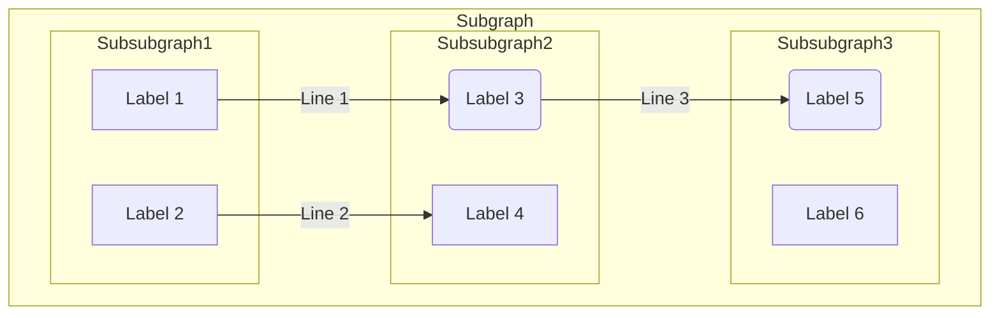
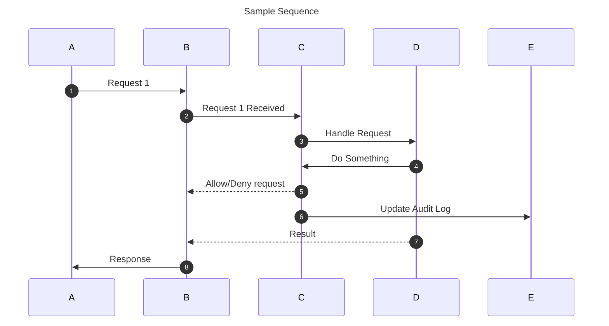
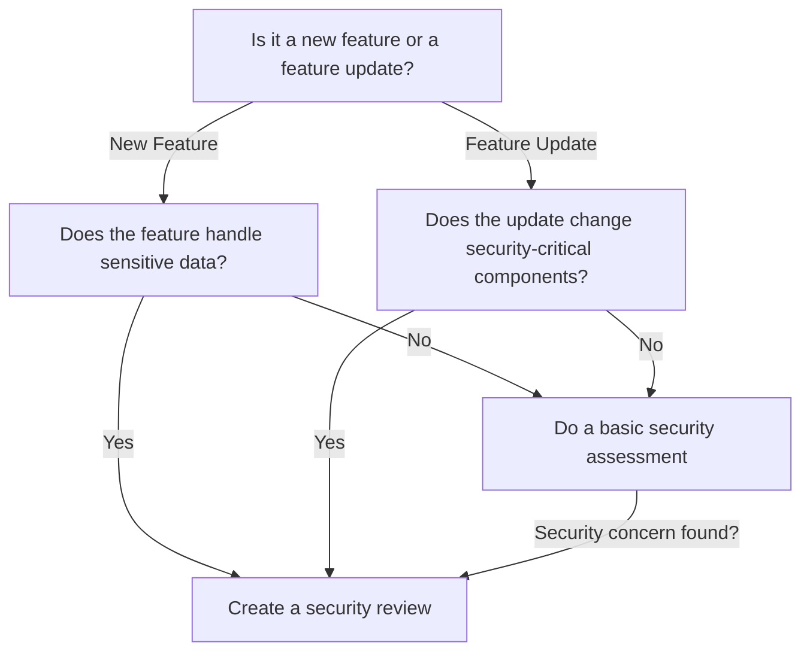

- [Using this Document](#using-this-document)
	- [Feature Description](#feature-description-)
	- [Architecture Diagram](#architecture-diagram)
		- [API Diagram](#api-diagram)
	- [Documenting your Feature](#documenting-your-feature)
	- [Security Reviews](#security-reviews)

## Document Checklist
- [ ] Architecture diagram created 
- [ ] API diagram created
- [ ] Documentation pull request opened
- [ ] Security review opened if required

<!--
# Using this Document

This document provides an easy-to-use template to help you get started building your own design document for OpenSearch features.

To use this document you should:

1. Copy and paste the contents of the document to a new file <YOUR_FEATURE>.md or to the body of a GitHub comment.
2. Fill out the remainder of this document.

**Please do not overwrite this document.**

-->

## Feature Description

<!--
_Please provide a **brief** description of what feature you are introducing and what it does. This should include information about the scope of the change and and its technical aspects. It should not reiterate the GitHub description._

For example: This feature creates a token with properties x, y, & z, it will have Rest APIs: POST /_security/foo/token { ... }. It will add functionality in class files AFactory, BSingleton, and CInstance.
-->

This document outlines a new feature <YOUR_FEATURE>.

<YOUR_FEATURE> is...

## Architecture Diagram

<!--_Some features are best explained using architecture diagrams. In particular, Mermaid diagrams are supported by GitHub and preferred. You can find examples of Mermaid diagrams in the [ARCHITECTURE.md](./ARCHITECTURE.md) file._-->

<!--Here is a generic graph diagram you can modify:-->

<!--Similarly, this is a sample sequence diagram:-->

<!--There are several other types of diagrams also supported by Mermaid.-->

### API Diagram

<!--If your change introduces new API routes, please provide a diagram of the changes.-->

<!--The sequence diagram is recommended for this purpose:-->

## Documenting your Feature

<!--Whenever you are making a large change, you should make sure you have created the appropriate updates to the documentation website.

Please use this section as a reminder to submit a pull request to the documentation repository with the details of your change.

If you do not complete this step, your pull request may not be merged.

Please link your documentation pull request here when it is complete and check the box below.-->

## Security Reviews

Certain changes require advanced security reviews by parties which depend on OpenSearch.

As part of this process, we request that the following decision tree is used to determine in which cases an advanced security review is required.

In cases where an advanced review is required, additional time is needed to merge pull requests. In these cases, the earlier pertinent information is provided the better.

Please denote whether a review is expected to be required.

