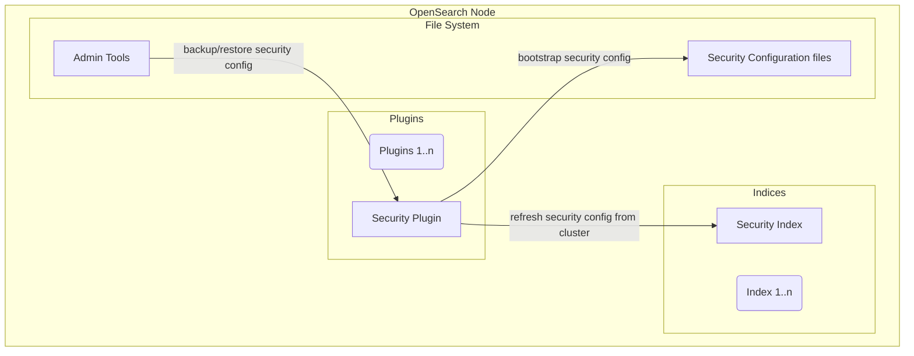
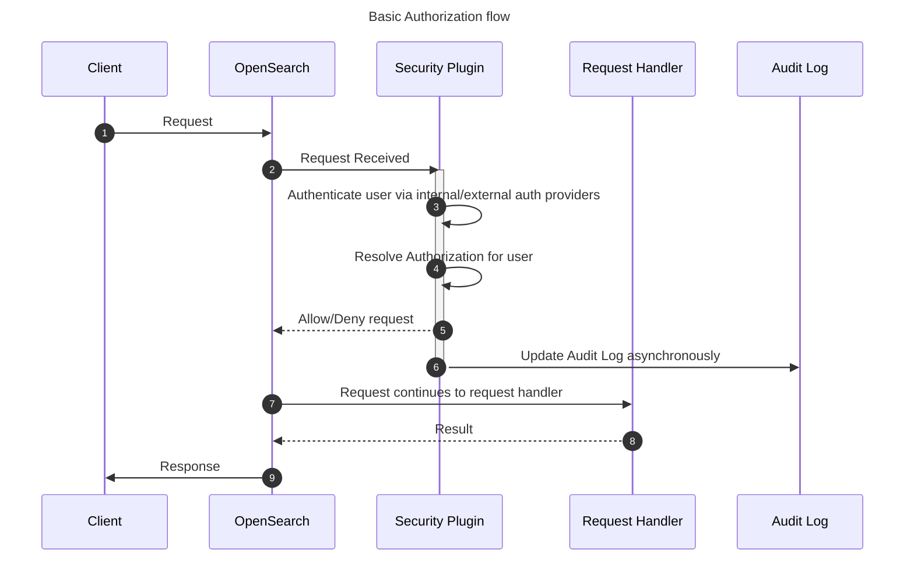
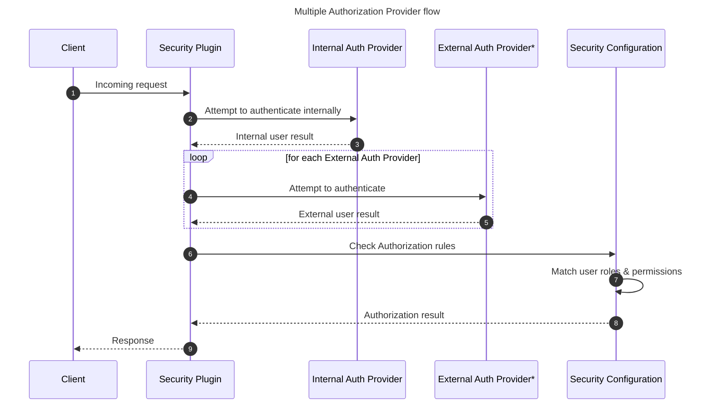
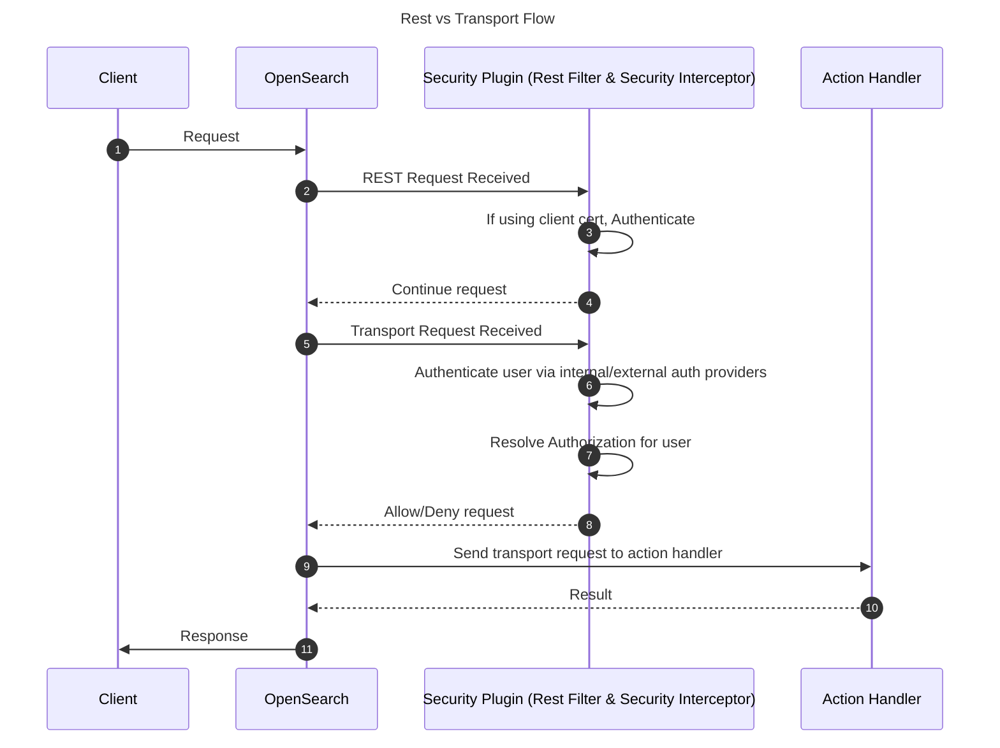

# OpenSearch Security Plugin Architecture

OpenSearch’s core systems do not include security features, these features are added by installing the Security Plugin. The Security Plugin extends OpenSearch to provide authentication, authorization, end to end Encryption, audit logging, and management interfaces.

## Components

The Security Plugin is packaged into a standard plugin zip file used by OpenSearch which can be installed by using the plugin tool. The security configuration is accessible on disk for modification before the node has been turned on.  After node startup, the admin tools or API endpoints can be used for dynamic changes.

### Security Plugin

The runtime of the Security Plugin uses extension points to insert itself into the path actions. Several security management actions are registered in OpenSearch so they can be changed through REST API actions.

### Security Configuration

The security configuration is stored in an system index that is replicated to all nodes. When a change has been made the Security plugin is reloaded to cleanly initialize its components with the new configuration.

#### Configuration Files

When starting up with no security index detected in the cluster, the Security Plugin will attempt to load configuration files from disk into a new security index. The configuration files can be manually modified or sourced from a backup of a security index created using the admin tools.

### Admin Tools

For OpenSearch nodes to join a cluster, they need to have the same security configuration. Complete security configurations will include SSL settings and certificate files. The admin tools allow users to manage these settings and other features. 

## Flows

### Authentication / Authorization

The Security Plugin supports multiple authentication backends including an internal identity provider which works with HTTP basic authentication as well as support [external providers](https://opensearch.org/docs/latest/security/authentication-backends/authc-index/) such as OpenId Connect (OIDC) and SAML.

Authorization is governed by roles declared in the security configuration. Roles control resource access by referencing the transport action name and/or index names in combination with OpenSearch action names.  

Users are connected to roles through roles mapping including getting backend roles from the authentication provider and mapping them to the roles configured in the Security Plugin.

#### Multiple Authorization Provider flow

Based on the order within the Security Plugin's configuration authentication providers are iterated through to discover which provider can authenticate the user.

#### Rest vs Transport flow

OpenSearch treats external REST requests differently than internal transport requests. While REST requests allow for client-to-node communication and make use of API routes, transport requests are more structured and are used to communicate between nodes.

