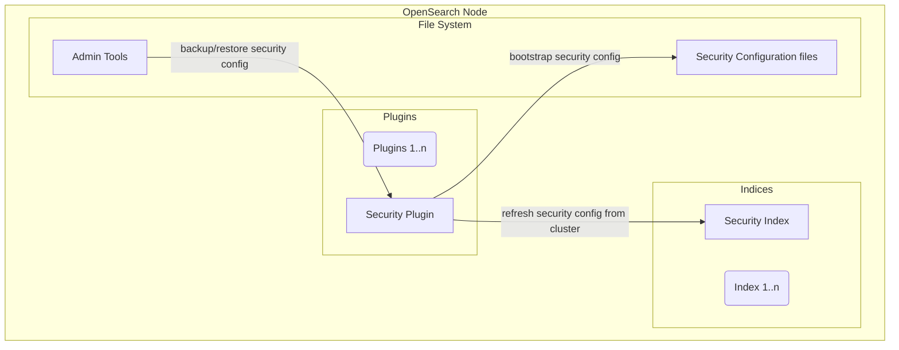
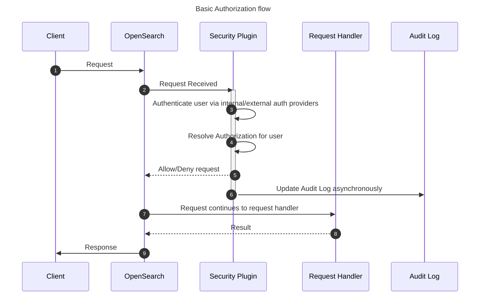
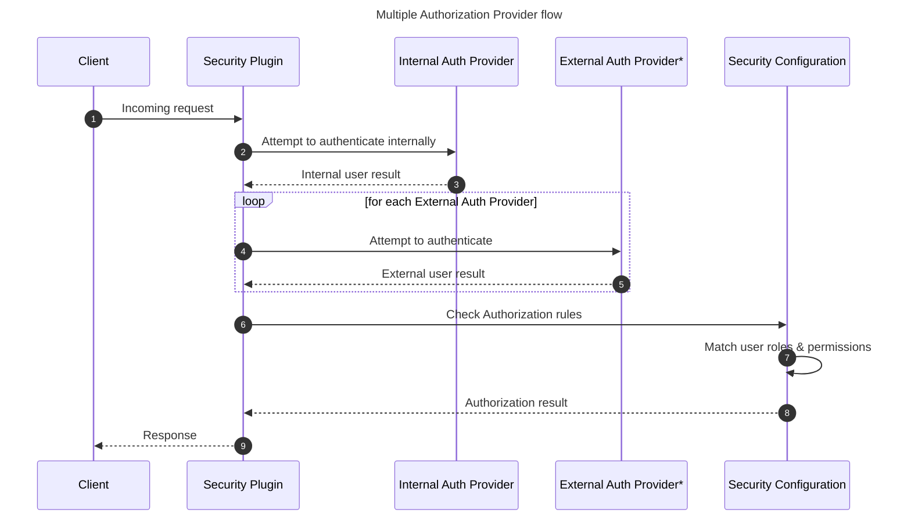
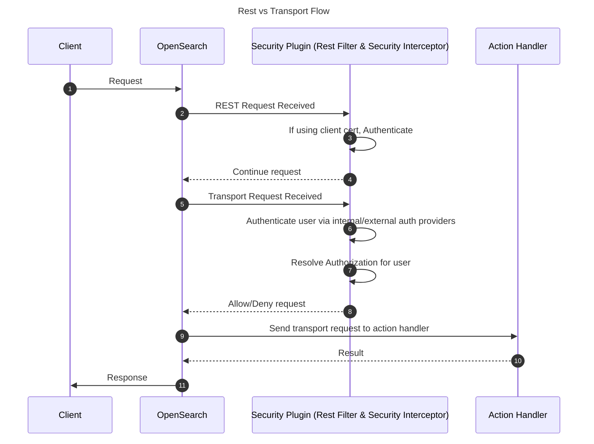
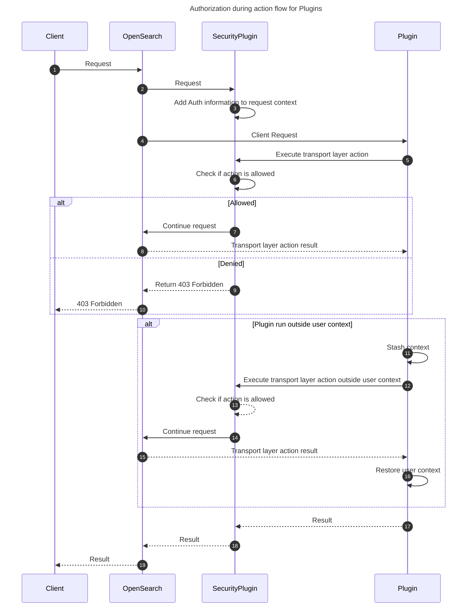
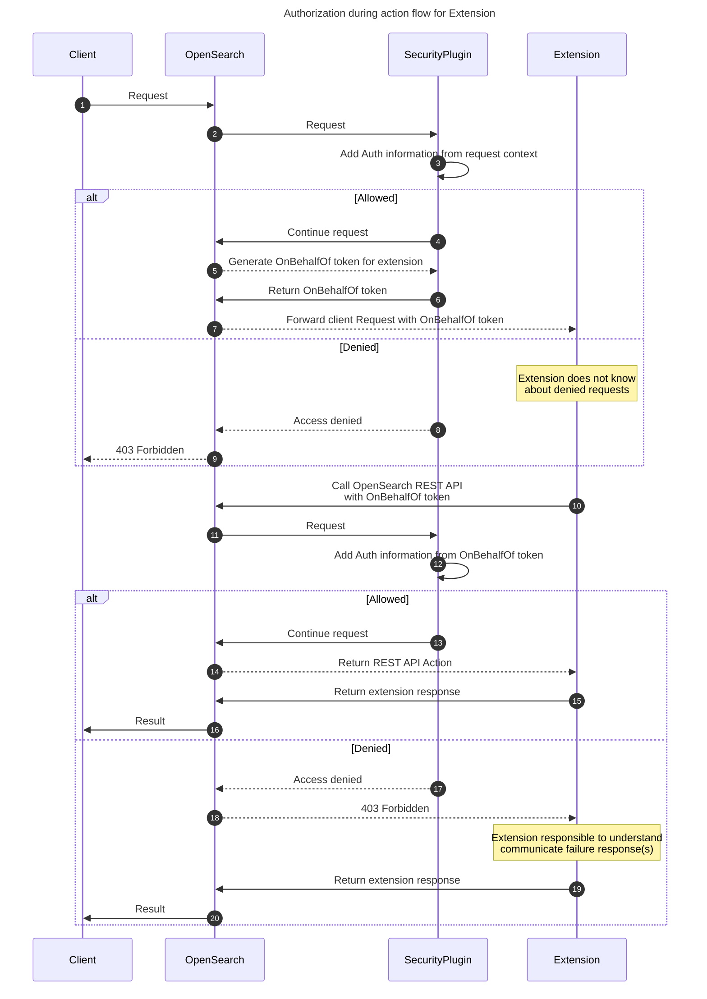
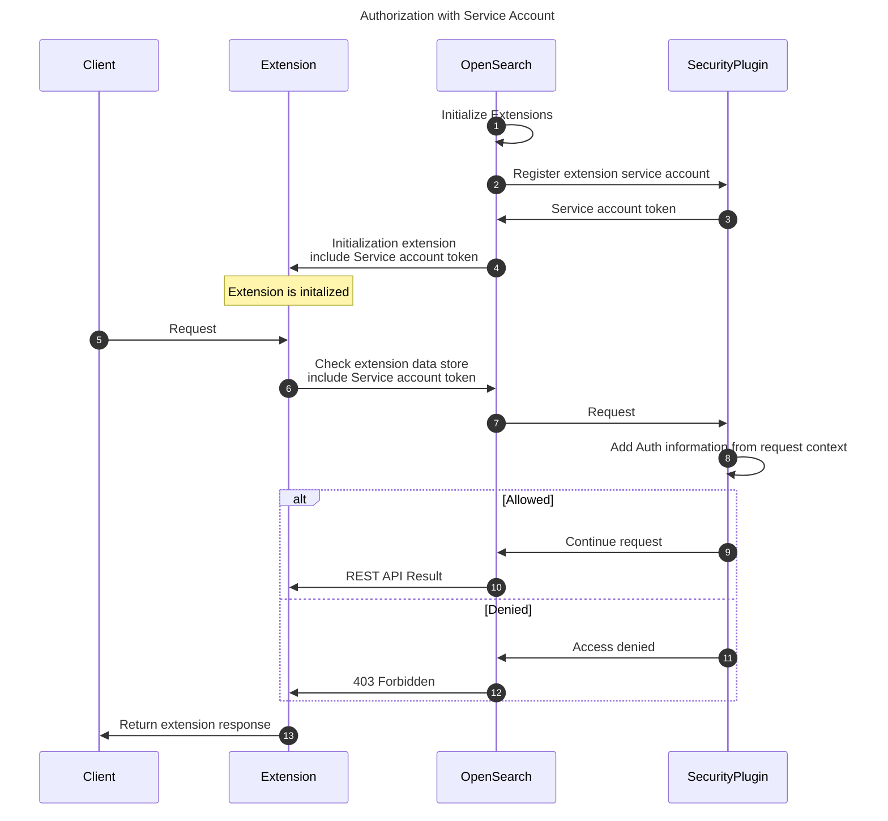

- [OpenSearch Security Plugin Architecture](#opensearch-security-plugin-architecture)
  - [Components](#components)
    - [Security Plugin](#security-plugin)
    - [Security Configuration](#security-configuration)
      - [Configuration Files](#configuration-files)
    - [Admin Tools](#admin-tools)
  - [Flows](#flows)
    - [Authentication / Authorization](#authentication--authorization)
      - [Multiple Authorization Provider flow](#multiple-authorization-provider-flow)
      - [Rest vs Transport flow](#rest-vs-transport-flow)
      - [Plugin Authorization Flows](#plugin-authorization-flows)
      - [Extension On Behalf Of Authorization Flows](#extension-on-behalf-of-authorization-flows)
      - [Extension Service Account Authorization](#extension-service-account-authorization)

# OpenSearch Security Plugin Architecture

OpenSearch’s core systems do not include security features, these features are added by installing the Security Plugin. The Security Plugin extends OpenSearch to provide authentication, authorization, end to end Encryption, audit logging, and management interfaces.

## Components

The Security Plugin is packaged into a standard plugin zip file used by OpenSearch which can be installed by using the plugin tool. The security configuration is accessible on disk for modification before the node has been turned on.  After node startup, the admin tools or API endpoints can be used for dynamic changes.

### Security Plugin

The runtime of the Security Plugin uses extension points to insert itself into the path actions. Several security management actions are registered in OpenSearch so they can be changed through REST API actions.

### Security Configuration

The security configuration is stored in an system index that is replicated to all nodes. When a change has been made to the configuration, the Security Plugin is reloaded to cleanly initialize its components with the new settings.

#### Configuration Files

When starting up with no security index detected in the cluster, the Security Plugin will attempt to load configuration files from disk into a new security index. The configuration files can be manually modified or sourced from a backup of a security index created using the admin tools.

### Admin Tools

For OpenSearch nodes to join a cluster, they need to have the same security configuration. Complete security configurations will include SSL settings and certificate files. The admin tools allow users to manage these settings and other features.

## Flows

### Authentication / Authorization

The Security Plugin supports multiple authentication backends including an internal identity provider which works with HTTP basic authentication as well as support [external providers](https://opensearch.org/docs/latest/security/authentication-backends/authc-index/) such as OpenId Connect (OIDC) and SAML.

Authorization is governed by roles declared in the security configuration. Roles control resource access by referencing the transport action name and/or index names in combination with OpenSearch action names.

Users are assigned roles via the role mappings. These mappings include backend role assignments from authentication providers as well as internal roles defined in the Security Plugin.

#### Multiple Authorization Provider flow

Based on the order within the Security Plugin's configuration authentication providers are iterated through to discover which provider can authenticate the user.

#### Rest vs Transport flow

OpenSearch treats external REST requests differently than internal transport requests. While REST requests allow for client-to-node communication and make use of API routes, transport requests are more structured and are used to communicate between nodes.

#### Plugin Authorization Flows

Plugins that implement ActionPlugin can register REST and Transport layer handlers which can receive requests from the user and other nodes in the cluster, respectively.  During the lifecycle of an incoming requests there are two standard ways to handle authorized actions in these flows.  One us to use the authenticated user, the other is to run outside the user context.

As in the normal authorization flow into the service the user is authenticated, then the action is determined, and finally an authorization check for the user is performed, and they are allowed or denied.  This can be thought of as running on behalf of the user.

There are some actions run by plugins that do not reuse the authentication or authorization of the current user, such as to make changes to internal cluster state for cross cluster replication.  When requests come in for these actions they are run outside the user context.

> Operating outside the user context means that no authorization checks are performed.  This is used to elevate plugin activities such as modifications to system indices, operations on the cluster configuration, and to ensure actions on the cluster are not associated with a singular user.

#### Extension On Behalf Of Authorization Flows

Extensions will be able to operate in similar flows as Plugins to ensure authorization is correctly handled.  Registration of REST handlers is allowed and transport layer actions are not permitted.  After the request has been authorized for the user to be transmitted to the extension the token generator will create a just in time token for use with that request on behalf of the user.

> On Behalf Of tokens are an optional feature, while supported through the extensions API it needs to be enabled on an individual extension basis.  Issuing On Behalf Of tokens can be disabled which will alter request forward to the extension not to include the On Behalf Of token.

#### Extension Service Account Authorization

Service account information is provided to the extension on initialization.  This allows extension to make requests against the OpenSearch Cluster without needing an incoming request.  Since this request is down in the context of a different identity it can have different permissions from that of an On Behalf Of user such as modification to a persistent data store used by the extension.

