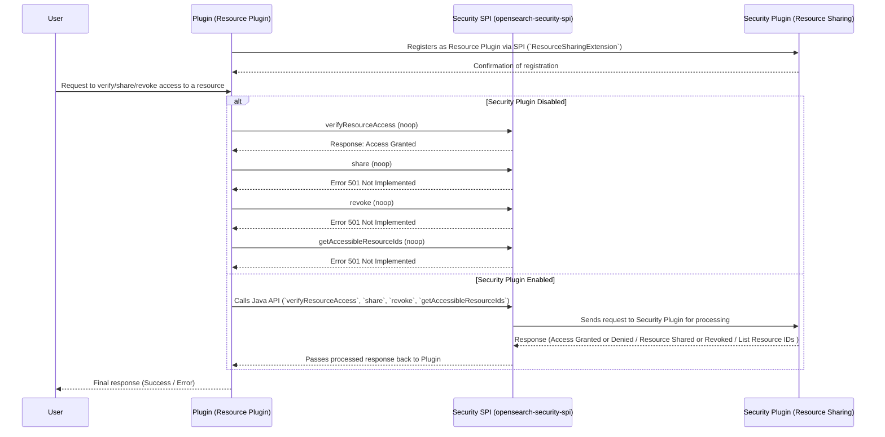

# **Resource Sharing and Access Control in OpenSearch**

This guide provides an **in-depth overview** for **plugin developers**, covering the **features, setup, and utilization** of the **Resource Sharing and Access Control** functionality in OpenSearch.

## **1. What is the Feature?**
The **Resource Sharing and Access Control** feature in OpenSearch Security Plugin enables fine-grained access management for resources declared by plugins. It allows:
- Users to **share and revoke access** to their own resources.
- **Super admins** to access all resources.
- Plugins to **define and manage resource access** via a standardized interface.

This feature ensures **secure** and **controlled** access to shareableResources while leveraging existing **index-level authorization** in OpenSearch.

---

## **2. What are the Components?**
This feature introduces **one primary component** for plugin developers:

### **1. `opensearch-security-spi`**
- A **Service Provider Interface (SPI)** that provides `ResourceSharingExtension` interface that plugins must implement to declare themselves as **Resource Plugins**.
- The security plugin keeps track of these plugins (similar to how JobScheduler tracks `JobSchedulerExtension`).
- Provides resource plugins with a **client** to implement access control.

### **Plugin Implementation Requirements:**

- This feature is marked as **`@opensearch.experimental`** and can be toggled using the feature flag: **`plugins.security.experimental.resource_sharing.enabled`**, which is **disabled by default**.
- **Resource indices must be system indices**, and **system index protection must be enabled** (`plugins.security.system_indices.enabled: true`) to prevent unauthorized direct access.
- Plugins must declare dependency on **`opensearch-security-spi`** in their `build.gradle`.

### **Plugin Implementation Requirements**
Each plugin must:
- **Declare a `compileOnly` dependency** on `opensearch-security-spi` package:
```build.gradle
compileOnly group: 'org.opensearch', name:'opensearch-security-spi', version:"${opensearch_build}"
```
- **Extend** `opensearch-security` plugin with optional flag:
```build.gradle
opensearchplugin {
    name '<your-plugin>'
    description '<description>'
    classname '<your-classpath>'
    extendedPlugins = ['opensearch-security;optional=true', <any-other-extensions>]
}
```
- **Implement** the `ResourceSharingExtension` class.
- **Ensure** that each resource index only contains 1 type of resource.
- **Register itself** in `META-INF/services` by creating the following file:
  ```
  src/main/resources/META-INF/services/org.opensearch.security.spi.ResourceSharingExtension
  ```
    - This file must contain a **single line** specifying the **fully qualified class name** of the plugin’s `ResourceSharingExtension` implementation, e.g.:
      ```
      org.opensearch.sample.SampleResourceSharingExtension
      ```

---

## **3. Feature Flag**
This feature is controlled by the following flag:

- **Feature flag:** `plugins.security.experimental.resource_sharing.enabled`
- **Default value:** `false`
- **How to enable?** Set the flag to `true` in the opensearch configuration:
  ```yaml
  plugins.security.experimental.resource_sharing.enabled: true
  ```

---

## **4. Resource Sharing API Design**

### **Resource Sharing Index (`.opensearch_resource_sharing`)**

The `.opensearch_resource_sharing` index centrally stores **resource access metadata**, mapping **resources to their access control policies**.


|**Field**  |**Type** |Description  |
|---  |---  |---  |
|`source_idx` |String |The system index where the resource is stored. |
|`resource_id`  |String |Unique ID of the resource within `source_idx`. |
|`created_by` |Object |Information about the user or backend role that created the resource.  |
|`share_with` |Object |Contains multiple objects with **scopes** as keys and access details as values.  |

* * *

#### **`created_by`**

### This object contains details about the **creator** of the resource.

|**Field**  |**Type** |Description  |
|---  |---  |---  |
| user|String |The username of the creator. |

**Example:**

```
"created_by": {
   "user": "darshit"
}
```

#### **`share_with`**

The `share_with` field **contains multiple objects**, where each **key is an action-group (e.g., `read`, `read_write`)**, and the **value is an object defining access control**.

|Scope Key  |**Type** |Description  |
|---  |---  |---  |
|<action-group> |Object |Define access level for its corresponding users, roles, and backend roles  |

**Example:**

```
"share_with": {
   "action-group1": {
      "users": ["user1", "user2"],
      "roles": ["viewer_role"],
      "backend_roles": ["data_analyst"]
   },
   "action-group2": {
      "users": ["admin_user"],
      "roles": ["editor_role"],
      "backend_roles": ["content_manager"]
   }
}
```

**NOTE**: For v1 of this feature, there is only one action-group named `default` as the infrastructure to support multiple action-groups in Security Plugin is not yet implemented.

#### **Each Action-Group in `share_with`**

Each **action-group** entry contains the following access definitions:

|**Field**  |**Type** |Description  |
|---  |---  |---  |
|`users`  |Array  |List of usernames granted access under this action-group. |
|`roles`  |Array  |List of OpenSearch roles granted access under this action-group.  |
|`backend_roles`  |Array  |List of backend roles granted access under this action-group. |

**Example:**

```
"action-group1": {
   "users": ["user1", "user2"],
   "roles": ["viewer_role"],
   "backend_roles": ["data_analyst"]
}
```


### **Full `.opensearch_resource_sharing` Document**

```
{
   "source_idx": ".plugins-ml-model-group",
   "resource_id": "model-group-123",
   "created_by": {
      "user": "darshit"
   },
   "share_with": {
      "action-group1": {
         "users": ["user1", "user2"],
         "roles": ["viewer_role"],
         "backend_roles": ["data_analyst"]
      },
      "action-group2": {
         "users": ["admin_user"],
         "roles": ["editor_role"],
         "backend_roles": ["content_manager"]
      }
   }
}
```

---

## **5. Declaring a Resource Plugin and Using the Client for Access Control**

### **Declaring a Plugin as a Resource Plugin**
To integrate with the security plugin, your plugin must:
1. Extend `ResourceSharingExtension` and implement required methods.
2. Implement a client accessor to utilize `ResourceSharingClient`.

[`opensearch-security-spi` README.md](./spi/README.md) is a great resource to learn more about the components of SPI and how to set up.

### **Calling Access Control Methods from the ResourceSharingClient Client**
The client provides **four access control methods** for plugins. For detailed usage and implementation, refer to the [`opensearch-security-spi` README.md](./spi/README.md#available-java-apis)

### **1. `verifyResourceAccess`**

**Checks if the current user has access to a resource.**

```
void verifyResourceAccess(String resourceId, String resourceIndex, ActionListener<Boolean> listener);
```

### **2. `share`**

**Grants access to a resource for specified users, roles, and backend roles.**

```
void share(String resourceId, String resourceIndex, SharedWithActionGroup.ActionGroupRecipients recipients, ActionListener<ResourceSharing> listener);
```

### **3. `revoke`**

**Removes access permissions for specified users, roles, and backend roles.**

```
void revoke(String resourceId, String resourceIndex, SharedWithActionGroup.ActionGroupRecipients entitiesToRevoke, ActionListener<ResourceSharing> listener);
```

### **4. `getAccessibleResourceIds`**

**Retrieves ids of all resources the current user has access to.**

```
void getAccessibleResourceIds(String resourceIndex, ActionListener<Set<String>> listener);
```

> For more details, refer [spi/README.md](./spi/README.md#available-java-apis)

Example usage:
```java
@Inject
public ShareResourceTransportAction(TransportService transportService, ActionFilters actionFilters) {
    super(ShareResourceAction.NAME, transportService, actionFilters, ShareResourceRequest::new);
}

@Override
protected void doExecute(Task task, ShareResourceRequest request, ActionListener<ShareResourceResponse> listener) {
    if (request.getResourceId() == null || request.getResourceId().isEmpty()) {
        listener.onFailure(new IllegalArgumentException("Resource ID cannot be null or empty"));
        return;
    }

    ResourceSharingClient resourceSharingClient = ResourceSharingClientAccessor.getInstance().getResourceSharingClient();
    if (resourceSharingClient == null) {
        log.debug("Resource Access Control feature is not available");
        listener.onFailure(
                new OpenSearchStatusException("Resource Access Control feature is not available", RestStatus.NOT_IMPLEMENTED)
        );
        return;
    }
    resourceSharingClient.share(
            request.getResourceId(),
            RESOURCE_INDEX_NAME,
            request.getShareWith(),
            ActionListener.wrap(sharing -> {
                ShareResourceResponse response = new ShareResourceResponse(sharing.getShareWith());
                log.debug("Shared resource: {}", response.toString());
                listener.onResponse(response);
            }, listener::onFailure)
    );
}
```

#### **Sample Request Flow:**




---

## **6. What are ActionGroups?**

This feature uses a **sharing mechanism** called **ActionGroups** to define the **level of access** granted to users for a resource. Currently, only one action group is available: `default`.

When sharing a resource, users must understand that access is tied to **API permissions**. For example, if a user has delete permissions, they can delete any resource shared with them.

By default, all `shareableResources` are private — visible only to their **owner** and **super-admins**. A resource becomes accessible to others only when explicitly shared.

> This mechanism will be more actively used once the Resource Authorization framework is implemented as a standalone feature.

### **Example: Publicly Shared Resource**

To make a resource accessible to everyone, share it with all entities using the wildcard `*`:

```json
{
  "share_with": {
    "default": {
      "backend_roles": ["*"],
      "roles": ["*"],
      "users": ["*"]
    }
  }
}
```

This grants access to:
- **All backend roles** via `"backend_roles": ["*"]`
- **All roles** via `"roles": ["*"]`
- **All users** via `"users": ["*"]`

**The resource becomes publicly accessible to all entities.**

### **Example: Restricted/Exclusively Shared Resource**

To restrict access to specific users, roles, or backend roles:

```json
{
  "share_with": {
    "default": {
      "backend_roles": ["backend_role1"],
      "roles": ["role1"],
      "users": ["user1"]
    }
  }
}
```

This grants access only to:
- Backend role: `backend_role1`
- Role: `role1`
- User: `user1`

**The resource is accessible only to the specified entities.**


### **Example: Private Resource**

To keep a resource fully private:

```json
{
  "share_with": {}
}
```

Since no entities are listed, the resource is accessible **only by its creator and super-admins**.

**This is the default state for all new resources.**

---

## **7. User Setup**

To enable users to interact with the **Resource Sharing and Access Control** feature, they must be assigned the appropriate cluster permissions along with resource-specific access.

### **Required Cluster Permissions**
Users must be assigned the following **cluster permissions** in `roles.yml`:

- **Plugin-specific cluster permissions** → Required to interact with the plugin’s APIs.

#### **Example Role Configurations**
```yaml
sample_full_access:
  cluster_permissions:
    - 'cluster:admin/sample-resource-plugin/*'

sample_read_access:
  cluster_permissions:
    - 'cluster:admin/sample-resource-plugin/get'
```

### **User Access Rules**
1. **Users must have the required cluster permissions**
    - Even if a resource is shared with a user, they **cannot access it** unless they have the **plugin’s cluster permissions**.

2. **Granting plugin API permissions does not automatically grant resource access**
    - A resource must be **explicitly shared** with the user.
    - **Or, the user must be the resource owner.**

3. **No index permissions are required**
    - Access control is **handled at the cluster level**.
    - The `.opensearch_resource_sharing` index and the resource indices are protected under system index security.


### **Summary**
| **Requirement** | **Description**                                                                       |
|---------------|---------------------------------------------------------------------------------------|
| **Plugin API Permissions** | Users must also have relevant plugin API cluster permissions.                         |
| **Resource Sharing** | Access is granted only if the resource is shared with the user or they are the owner. |
| **No Index Permissions Needed** | The `.opensearch_resource_sharing` index and resource indices are system-protected.   |


---

## **8. Restrictions**
1. At present, **only resource owners can share/revoke access** to their own resources.
    - **Super admins** can manage access for any resource.
2. **Resources must be stored in a system index**, and system index protection **must be enabled**.
    - **Disabling system index protection** allows users to access resources **directly** if they have relevant index permissions.

---

## **9. Best Practices**

### **For Plugin Developers**
- **Declare resources properly** in the `ResourceSharingExtension`.
- **Use the resource sharing client** instead of direct index queries to check access.

### **For Users & Admins**
- **Keep system index protection enabled** for better security.
- **Grant access only when necessary** to limit exposure.

---

### **Additional Notes**
- **Feature Flag:** These APIs are available only when `plugins.security.experimental.resource_sharing.enabled` is set to `true` in the configuration.
- **Index Restrictions:** Resources must be stored in **system indices**, and **system index protection** must be enabled to prevent unauthorized access.

---

## **Conclusion**
The **Resource Sharing and Access Control** feature enhances OpenSearch security by introducing an **additional layer of fine-grained access management** for plugin-defined shareableResources. While **Fine-Grained Access Control (FGAC)** is already enabled, this feature provides **even more granular control** specifically for **resource-level access** within plugins.

By implementing the **Service Provider Interface (SPI)** and following **best practices**, developers can seamlessly integrate this feature into their plugins to enforce controlled resource sharing and access management.

For detailed implementation and examples, refer to the **[sample plugin](./sample-resource-plugin/README.md)** included in the security plugin repository.

---

## **License**
This project is licensed under the **Apache 2.0 License**.

---

## **Copyright**
© OpenSearch Contributors.
