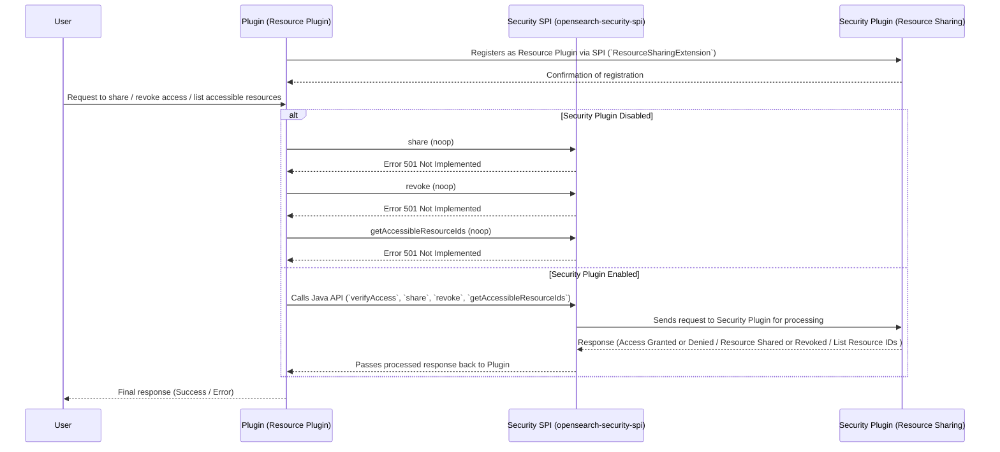

# OpenSearch Resource Sharing and Access Control

This document provides a complete guide to the Resource Sharing and Access Control feature in OpenSearch, divided into two parts: one for plugin developers and one for users and administrators.

## Overview

Starting from version **3.2.0**, the OpenSearch Security Plugin introduces a **resource sharing framework** that enables **document-level access control** across plugins. This feature allows a **resource owner** (creator of a document) to share that resource with specific **users, roles, or backend_roles** at configurable **access levels** (e.g., `read_only`, `read_write`).

> A "resource" is currently defined as a **document in an index**. This sharing model is useful in multi-tenant environments and powers resource-level security in OpenSearch Dashboards and other REST clients.

**Key capabilities:**
- Share access to your resource with fine-grained control
- Manage sharing configurations using a REST API
- Migrate existing sharing data from plugin-managed storage into the centralized security-owned index

The implementation proposal and discussion can be found here:
🔗 [GitHub Issue #4500](https://github.com/opensearch-project/security/issues/4500)

---

# Part 1: Plugin Developer Guide

This guide provides an **in-depth overview** for **plugin developers**, covering the **features, setup, and utilization** of the **Resource Sharing and Access Control** functionality in OpenSearch.

## **1. What is the Feature?**
The **Resource Sharing and Access Control** feature in OpenSearch Security Plugin enables fine-grained access management for resources declared by plugins. It allows:
- Users to **share and revoke access** to their own resources.
- **Super admins** to access all resources.
- Plugins to **define and manage resource access** via a standardized interface.

This feature ensures **secure** and **controlled** access to shareableResources while leveraging existing **index-level authorization** in OpenSearch.

NOTE: This feature is marked as **`@opensearch.experimental`** and can be toggled using the feature flag: **`plugins.security.experimental.resource_sharing.enabled`**, which is **disabled by default**.


## **2. What are the Components?**
This feature introduces **one primary component** for plugin developers:

### **1. `opensearch-security-spi`**
- A **Service Provider Interface (SPI)** that provides `ResourceSharingExtension` interface that plugins must implement to declare themselves as **Resource Plugins**.
- The security plugin keeps track of these plugins (similar to how JobScheduler tracks `JobSchedulerExtension`).
- Provides resource plugins with a **client** to implement access control.

### **Plugin Implementation Requirements:**

- **Resource indices must be declared as system indices** to prevent unauthorized direct access.
- **Declare a `compileOnly` dependency** on `opensearch-security-spi` package:
```build.gradle
compileOnly group: 'org.opensearch', name:'opensearch-security-spi', version:"${opensearch_build}"
```
- **Extend** `opensearch-security` plugin with the optional flag:
```build.gradle
opensearchplugin {
    name '<your-plugin>'
    description '<description>'
    classname '<your-classpath>'
    extendedPlugins = ['opensearch-security;optional=true', <any-other-extensions>]
}
```
- **Create** ResourceSharingClientAccessor class. For guidance, refer [SPI README.md](./spi/README.md#4-create-the-resourcesharingclientaccessor-class).
- **Implement** the `ResourceSharingExtension` class.
- **Ensure** that each resource index only contains 1 type of resource.
- **Register itself** in `META-INF/services` by creating the following file:
  ```
  src/main/resources/META-INF/services/org.opensearch.security.spi.ResourceSharingExtension
  ```
  - This file must contain a **single line** specifying the **fully qualified class name** of the plugin’s `ResourceSharingExtension` implementation, e.g.:
    ```
    org.opensearch.sample.SampleResourceSharingExtension
    ```


## **3. Resource Sharing API Design**

### **Resource Sharing Index **

Each plugin receives its own sharing index, centrally managed by security plugin, which stores **resource access metadata**, mapping **resources to their access control policies**.


|**Field**  |**Type** | Description                                                                            |
|---  |---  |----------------------------------------------------------------------------------------|
|`source_idx` |String | The system index where the resource is stored.                                         |
|`resource_id`  |String | Unique ID of the resource within `source_idx`.                                         |
|`created_by` |Object | Information about the user or backend role that created the resource.                  |
|`share_with` |Object | Contains multiple objects with **access-levels** as keys and access details as values. |

NOTE: **action-groups** and **access-levels** are used inter-changeably throughout this document, as they carry the same meaning in the context of this feature.

#### **`created_by`**

### This object contains details about the **creator** of the resource.

|**Field**  |**Type** |Description  |
|---  |---  |---  |
| user|String |The username of the creator. |

**Example:**

```
"created_by": {
   "user": "darshit"
}
```

#### **`share_with`**

The `share_with` field **contains multiple objects**, where each **key is an action-group (e.g., `read`, `read_write`)**, and the **value is an object defining access control**.

|Scope Key  |**Type** |Description  |
|---  |---  |---  |
|<action-group> |Object |Define access level for its corresponding users, roles, and backend roles  |

**Example:**

```
"share_with": {
   "action-group1": {
      "users": ["user1", "user2"],
      "roles": ["viewer_role"],
      "backend_roles": ["data_analyst"]
   },
   "action-group2": {
      "users": ["admin_user"],
      "roles": ["editor_role"],
      "backend_roles": ["content_manager"]
   }
}
```

**NOTE**: The action-groups here are synonymous with the existing action-groups in security plugin and can be used to share/revoke resource access.

#### **Each Action-Group in `share_with`**

Each **action-group** entry contains the following access definitions:

|**Field**  |**Type** |Description  |
|---  |---  |---  |
|`users`  |Array  |List of usernames granted access under this action-group. |
|`roles`  |Array  |List of OpenSearch roles granted access under this action-group.  |
|`backend_roles`  |Array  |List of backend roles granted access under this action-group. |

**Example:**

```
"action-group1": {
   "users": ["user1", "user2"],
   "roles": ["viewer_role"],
   "backend_roles": ["data_analyst"]
}
```


### **Example Resource-Sharing Document**

```
{
   "source_idx": ".plugins-ml-model-group",
   "resource_id": "model-group-123",
   "created_by": {
      "user": "darshit"
   },
   "share_with": {
      "action-group1": {
         "users": ["user1", "user2"],
         "roles": ["viewer_role"],
         "backend_roles": ["data_analyst"]
      },
      "action-group2": {
         "users": ["admin_user"],
         "roles": ["editor_role"],
         "backend_roles": ["content_manager"]
      }
   }
}
```

## **4. Using the Client for Access Control**

[`opensearch-security-spi` README.md](./spi/README.md) is a great resource to learn more about the components of SPI and how to set up.

### **Calling Access Control Methods from the ResourceSharingClient Client**
The client provides **four access control methods** for plugins. For detailed usage and implementation, refer to the [`opensearch-security-spi` README.md](./spi/README.md#available-java-apis)

### **1. `verifyAccess`**

**Check if the current user has access to a resource with provided action.**
NOTE: Security plugin offers an evaluator to evaluate resource access requests through Security Filter. This method should only be used when such evaluation is not possible.

```
void verifyAccess(String resourceId, String resourceIndex, String action, ActionListener<Boolean> listener);
```

### **2. `share`**

**Grants access to a resource for specified users, roles, and backend roles.**

```
void share(String resourceId, String resourceIndex, ShareWith target, ActionListener<ResourceSharing> listener);
```

### **3. `revoke`**

**Removes access permissions for specified users, roles, and backend roles.**

```
void revoke(String resourceId, String resourceIndex, ShareWith target, ActionListener<ResourceSharing> listener);
```

### **4. `getAccessibleResourceIds`**

**Retrieves ids of all resources the current user has access to, regardless of the access-level.**

```
void getAccessibleResourceIds(String resourceIndex, ActionListener<Set<String>> listener);
```

Example usage:
```java
@Inject
public ShareResourceTransportAction(
        TransportService transportService,
        ActionFilters actionFilters,
        SampleResourceExtension sampleResourceExtension
) {
    super(ShareResourceAction.NAME, transportService, actionFilters, ShareResourceRequest::new);
    this.resourceSharingClient = sampleResourceExtension == null ? null : sampleResourceExtension.getResourceSharingClient();
}

@Override
protected void doExecute(Task task, ShareResourceRequest request, ActionListener<ShareResourceResponse> listener) {
    if (request.getResourceId() == null || request.getResourceId().isEmpty()) {
        listener.onFailure(new IllegalArgumentException("Resource ID cannot be null or empty"));
        return;
    }

    if (resourceSharingClient == null) {
        listener.onFailure(
                new OpenSearchStatusException(
                        "Resource sharing is not enabled. Cannot share resource " + request.getResourceId(),
                        RestStatus.NOT_IMPLEMENTED
                )
        );
        return;
    }
    ShareWith shareWith = request.getShareWith();
    resourceSharingClient.share(request.getResourceId(), RESOURCE_INDEX_NAME, shareWith, ActionListener.wrap(sharing -> {
        ShareWith finalShareWith = sharing == null ? null : sharing.getShareWith();
        ShareResourceResponse response = new ShareResourceResponse(finalShareWith);
        log.debug("Shared resource: {}", response.toString());
        listener.onResponse(response);
    }, listener::onFailure));
}
```


> For more details, refer [spi/README.md](./spi/README.md#available-java-apis)

#### **Sample Request Flow:**



## **5. What are ActionGroups?**

This feature uses a **sharing mechanism** called **ActionGroups** to define the **level of access** granted to users for a resource. Currently, only one action group is available: `default`.

When sharing a resource, users must understand that access is tied to **API permissions**. For example, if a user has delete permissions, they can delete any resource shared with them.

By default, all `shareableResources` are private — visible only to their **owner** and **super-admins**. A resource becomes accessible to others only when explicitly shared.

> This mechanism will be more actively used once the Resource Authorization framework is implemented as a standalone feature.

### **Example: Publicly Shared Resource**

To make a resource accessible to everyone, share it with all entities using the wildcard `*`:

```json
{
  "share_with": {
    "default": {
      "backend_roles": ["*"],
      "roles": ["*"],
      "users": ["*"]
    }
  }
}
```

This grants access to:
- **All backend roles** via `"backend_roles": ["*"]`
- **All roles** via `"roles": ["*"]`
- **All users** via `"users": ["*"]`

**The resource becomes publicly accessible to all entities.**

### **Example: Restricted/Exclusively Shared Resource**

To restrict access to specific users, roles, or backend roles:

```json
{
  "share_with": {
    "default": {
      "backend_roles": ["backend_role1"],
      "roles": ["role1"],
      "users": ["user1"]
    }
  }
}
```

This grants access only to:
- Backend role: `backend_role1`
- Role: `role1`
- User: `user1`

**The resource is accessible only to the specified entities.**


### **Example: Private Resource**

To keep a resource fully private:

```json
{
  "share_with": {}
}
```

Since no entities are listed, the resource is accessible **only by its creator and super-admins**.

**This is the default state for all new resources.**


## **6. Restrictions**
1. **Resources must be stored in a system index**, and system index protection **must be enabled**.
  - **Disabling system index protection** allows users to access resources **directly** if they have relevant index permissions.


## **7. Best Practices For Plugin Developers**
- **Declare resources properly** in the `ResourceSharingExtension`.
- **Implement DocRequest** to utilize resource access control framework.
- **Use the resource sharing client** to curb access.


### **Additional Notes**
- **Feature Flag:** These APIs are available only when `plugins.security.experimental.resource_sharing.enabled` is set to `true` in the configuration.


---


## Part 2: Cluster-admin and User guide

## **1. Feature Flag**
This feature is controlled by the following flag:

- **Feature flag:** `plugins.security.experimental.resource_sharing.enabled`
- **Default value:** `false`
- **How to enable?** Set the flag to `true` in the opensearch configuration:
  ```yaml
  plugins.security.experimental.resource_sharing.enabled: true
  ```

## **2. User Setup**

To enable users to interact with the **Resource Sharing and Access Control** feature, they must be assigned the appropriate cluster permissions along with resource-specific access.

### **Required Cluster Permissions**
Users must be assigned the following **cluster permissions** in `roles.yml`:

- **Plugin-specific cluster permissions** → Required to interact with the plugin’s APIs.

#### **Example Role Configurations**
```yaml
sample_full_access:
  cluster_permissions:
    - 'cluster:admin/sample-resource-plugin/*'

sample_read_access:
  cluster_permissions:
    - 'cluster:admin/sample-resource-plugin/get'
```

### **User Access Rules**
1. **Users must have the required cluster permissions**
- Even if a resource is shared with a user, they **cannot access it** unless they have the **plugin’s cluster permissions**.

2. **Granting plugin API permissions does not automatically grant resource access**
- A resource must be **explicitly shared** with the user.
- **Or, the user must be the resource owner.**


### **Summary**
| **Requirement** | **Description**                                                                       |
|---------------|---------------------------------------------------------------------------------------|
| **Plugin API Permissions** | Users must also have relevant plugin API cluster permissions.                         |
| **Resource Sharing** | Access is granted only if the resource is shared with the user or they are the owner. |


## **3. Migration API (cluster admins)**

The **Migration API** is a one-time utility for cluster admins to migrate legacy sharing metadata from plugin indices into the centralized **resource-sharing index** owned by the security plugin.

### `POST /_plugins/_security/api/resources/migrate`

### **Description:**
Read documents from a plugin’s index and migrate ownership and backend role-based access into the centralized sharing model.

**Request Body**

| Parameter              | Type    | Required | Description                                                                 |
|------------------------|---------|----|-----------------------------------------------------------------------------|
| `source_index`         | string  | yes | Name of the plugin index containing the existing resource documents        |
| `username_path`        | string  | yes | JSON Pointer to the username field inside each document (e.g., `/owner`)   |
| `backend_roles_path`   | string  | yes | JSON Pointer to the backend_roles field (must point to a JSON array)       |
| `default_access_level` | string  | no | Default access level to assign migrated backend_roles (default: `"default"`) |

**Example Request**
`POST /_plugins/_security/api/resources/migrate`
**Request Body:**
```json
{
  "source_index": "sample_plugin_index",
  "username_path": "/owner",
  "backend_roles_path": "/access/backend_roles",
  "default_access_level": "read_only"
}
```

**Response:**

```json
{
  "summary": "Migration complete. migrated 10; skippedNoUser 2; failed 1",
  "skippedResources": ["doc-17", "doc-22"]
}
```


## **4. Resource Sharing API**

The **Resource Sharing API** allows users (typically via OpenSearch Dashboards or REST clients) to control **who can access their resources** and at what **access level**.

A **resource owner** (i.e., the document creator) can:
- Share access with specific users, roles, or backend roles
  - Users with sufficient permission can further share or revoke access to resource
- Grant read-only or read-write permissions
- Revoke or update access

### Base Path:
```
/_plugins/_security/api/resource/share
```

### 1. `PUT /_plugins/_security/api/resource/share`

**Description:**
Creates or replaces sharing settings for a resource.

**Request Body:**

```json
{
  "resource_id": "resource-123",
  "resource_index": "my-resource-index",
  "share_with": {
    "read_only": {
      "users": ["alice"],
      "roles": ["readers"],
      "backend_roles": ["data-readers"]
    },
    "read_write": {
      "users": ["bob"]
    }
  }
}
```

**Response:**

```json
{
  "sharing_info": {
    "resource_id": "resource-123",
    "created_by": { "username": "admin" },
    "share_with": {
      "read_only": {
        "users": ["alice"],
        "roles": ["readers"],
        "backend_roles": ["data-readers"]
      },
      "read_write": {
        "users": ["bob"]
      }
    }
  }
}
```

### 2. `PATCH /_plugins/_security/api/resource/share`

**Description:**
Updates sharing settings by **adding** or **removing** recipients at any access level. Unlike `PUT`, this is a **non-destructive** operation.

**Request Body:**

```json
{
  "resource_id": "resource-123",
  "resource_index": "my-resource-index",
  "patch": {
    "share_with": {
      "read_only": {
        "users": ["charlie"]
      }
    },
    "revoke": {
      "read_only": {
        "users": ["alice"]
      },
      "read_write": {
        "users": ["bob"]
      }
    }
  }
}
```

**Response:**

```json
{
  "sharing_info": {
    "resource_id": "resource-123",
    "created_by": { "username": "admin" },
    "share_with": {
      "read_only": {
        "users": ["charlie"],
        "roles": ["readers"],
        "backend_roles": ["data-readers"]
      },
      "read_write": {}
    }
  }
}
```

#### Allowed Keys in `patch`:
- `"share_with"` – Adds recipients
- `"revoke"` – Removes recipients


### 3. `GET /_plugins/_security/api/resource/share?resource_id=<id>&resource_index=<index>`

**Description:**
Retrieves the current sharing configuration for a given resource.

**Example Request:**

```
GET /_plugins/_security/api/resource/share?resource_id=resource-123&resource_index=my-resource-index
```

**Response:**

```json
{
  "sharing_info": {
    "resource_id": "resource-123",
    "created_by": { "username": "admin" },
    "share_with": {
      "read_only": {
        "users": ["charlie"],
        "roles": ["readers"],
        "backend_roles": ["data-readers"]
      },
      "read_write": {}
    }
  }
}
```


## Who Can Use This?

| API                                            | Permission Required               | Intended User     |
|------------------------------------------------|-----------------------------------|-------------------|
| `POST /_plugins/_security/api/resources/migrate` | REST admin or Super admin         | Cluster admin     |
| `PUT /_plugins/_security/api/resource/share`     | Resource Owner                    | Dashboards / REST |
| `PATCH /_plugins/_security/api/resource/share`    | Resource Owner / share permission | Dashboards / REST |
| `GET /_plugins/_security/api/resource/share`      | Resource Owner / read permission  | Dashboards / REST |


## When to Use

| Use Case                                            | API                        |
|-----------------------------------------------------|----------------------------|
| Migrating existing plugin-specific sharing configs  | `POST /_plugins/_security/api/resources/migrate` |
| Sharing a document with another user or role        | `PUT /_plugins/_security/api/resource/share`   |
| Granting/revoking access without affecting others   | `PATCH /_plugins/_security/api/resource/share` |
| Fetching the current sharing status of a resource   | `GET /_plugins/_security/api/resource/share`   |


## **5. Best Practices For Users & Admins**
- **Keep system index protection enabled** for better security.
- **Grant access only when necessary** to limit exposure.


---

## **Conclusion**
The **Resource Sharing and Access Control** feature enhances OpenSearch security by introducing an **additional layer of fine-grained access management** for plugin-defined shareableResources. While **Fine-Grained Access Control (FGAC)** is already enabled, this feature provides **even more granular control** specifically for **resource-level access** within plugins.

By implementing the **Service Provider Interface (SPI)** and following **best practices**, developers can seamlessly integrate this feature into their plugins to enforce controlled resource sharing and access management.

For detailed implementation and examples, refer to the **[sample plugin](./sample-resource-plugin/README.md)** included in the security plugin repository.

---

## **License**
This project is licensed under the **Apache 2.0 License**.

---

## **Copyright**
© OpenSearch Contributors.
