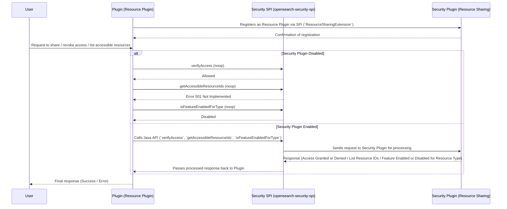

# OpenSearch Resource Sharing and Access Control

This document provides a complete guide to the Resource Sharing and Access Control feature in OpenSearch, divided into two parts: one for plugin developers and one for users and administrators.

## Overview

Starting from version **3.2.0**, the OpenSearch Security Plugin introduces a **resource sharing framework** that enables **document-level access control** across plugins. This feature allows a **resource owner** (creator of a document) to share that resource with specific **users, roles, or backend_roles** at configurable **access levels** (e.g., `read_only`, `read_write`).

> A "resource" is currently defined as a **document in an index**. This sharing model is useful in multi-tenant environments and powers resource-level security in OpenSearch Dashboards and other REST clients.

**Key capabilities:**
- Share access to your resource with fine-grained control
- Manage sharing configurations using a REST API
- Migrate existing sharing data from plugin-managed storage into the centralized security-owned index

The implementation proposal and discussion can be found here:
🔗 [GitHub Issue #4500](https://github.com/opensearch-project/security/issues/4500)

---

# Part 1: Plugin Developer Guide

This guide provides an **in-depth overview** for **plugin developers**, covering the **features, setup, and utilization** of the **Resource Sharing and Access Control** functionality in OpenSearch.

## **1. What is the Feature?**
The **Resource Sharing and Access Control** feature in OpenSearch Security Plugin enables fine-grained access management for resources declared by plugins. It allows:
- Users to **share and revoke access** to their own resources.
- **Super admins** to access all resources.
- Plugins to **define and manage resource access** via a standardized interface.

This feature ensures **secure** and **controlled** access to shareableResources while leveraging existing **index-level authorization** in OpenSearch.

NOTE: This feature is marked as **`@opensearch.experimental`** and can be toggled using the feature flag: **`plugins.security.experimental.resource_sharing.enabled`**, which is **disabled by default**.


## **2. What are the Components?**
This feature introduces **one primary component** for plugin developers:

### **1. `opensearch-security-spi`**
- A **Service Provider Interface (SPI)** that provides `ResourceSharingExtension` interface that plugins must implement to declare themselves as **Resource Plugins**.
- The security plugin keeps track of these plugins (similar to how JobScheduler tracks `JobSchedulerExtension`).
- Provides resource plugins with a **client** to implement access control.

### **Plugin Implementation Requirements:**

- **Resource indices must be declared as system indices** to prevent unauthorized direct access.
  NOTE: If system-index protection is disabled, requests will be evaluated as normal index requests.
- **Declare a `compileOnly` dependency** on `opensearch-security-spi` package and opensearch-security plugin zip:
```build.gradle
configurations {
  ...
  opensearchPlugin
  // OR uncomment following line
  // zipArchive
  ...
}

dependencies {
  ...
  compileOnly group: 'org.opensearch', name:'opensearch-security-spi', version:"${opensearch_build}"
  opensearchPlugin "org.opensearch.plugin:opensearch-security:${opensearch_build}@zip"
  // OR you can add following line if you added zipArchive configuration
  // zipArchive group: 'org.opensearch.plugin', name:'opensearch-security', version: "${opensearch_build}"
  ...
}
```
- **Extend** `opensearch-security` plugin with the optional flag:
```build.gradle
opensearchplugin {
    name '<your-plugin>'
    description '<description>'
    classname '<your-classpath>'
    extendedPlugins = ['opensearch-security;optional=true', <any-other-extensions>]
}
```
- **Implement** the `ResourceSharingExtension` interface. For guidance, refer [SPI README.md](./spi/README.md#4-implement-the-resourcesharingextension-interface).
- **Implement** the `ResourceSharingClientAccessor` wrapper class to access ResourceSharingClient. Refer [SPI README.md](./spi/README.md#5-implement-the-resourcesharingclientaccessor-class).
- If plugin implements search, add a **plugin client** if not already present. Can be copied from sample-plugin's [PluginClient.java](./sample-resource-plugin/src/main/java/org/opensearch/sample/utils/PluginClient.java).
- **Ensure** that each resource index only contains 1 type of resource.
- **Register itself** in `META-INF/services` by creating the following file:
  ```
  src/main/resources/META-INF/services/org.opensearch.security.spi.ResourceSharingExtension
  ```
  - This file must contain a **single line** specifying the **fully qualified class name** of the plugin’s `ResourceSharingExtension` implementation, e.g.:
    ```
    org.opensearch.sample.SampleResourceSharingExtension
    ```
- **Declare** action-groups **per resource** in `resource-action-groups.yml` file:
  ```
  src/main/resources/resource-action-groups.yml
  ```
  - This file must be structured in a following way:
    ```yml
    resource_types:
      <resource-type-1>:
          <action-group-1>:
              allowed_actions:
                  - <action1>
                  - <action2>
          <action-group-2>:
              allowed_actions:
                  - <action1>
                  - <action2>

      <resource-type-2>:
          <action-group-1>:
              allowed_actions:
                  - <action1>
                  - <action2>
          <action-group-2>:
              allowed_actions:
                  - <action1>
                  - <action2>

      # ...
    ```
**NOTE**: The resource-type supplied here must match the ones supplied in each of the resource-providers declared in the ResourceSharingExtension implementation.

#### **Example resource-action-groups yml**
```yml
resource_types:
  sample-resource:
      sample_read_only:
        - "cluster:admin/sample-resource-plugin/get"

      sample_read_write:
        - "cluster:admin/sample-resource-plugin/*"

      sample_full_access:
        - "cluster:admin/sample-resource-plugin/*"
        - "cluster:admin/security/resource/share"
```
- If your plugin enabled testing with security, add the following to you node-setup for `integTest` task:
```build.gradle
integTest {
    ...
    systemProperty "resource_sharing.enabled", System.getProperty("resource_sharing.enabled")
    ...
}
...
<test-cluster-setup-task> {
    ...
    node.setting("plugins.security.system_indices.enabled", "true")
    if (System.getProperty("resource_sharing.enabled") == "true") {
        node.setting("plugins.security.experimental.resource_sharing.enabled", "true")
        node.setting("plugins.security.experimental.resource_sharing.protected_types", "[\"anomaly-detector\", \"forecaster\"]")
    }
    ...
}
```

## **3. Resource Sharing API Design**

### **Resource Sharing Index**

Each plugin receives its own sharing index, centrally managed by security plugin, which stores **resource access metadata**, mapping **resources to their access control policies**.


|**Field**  |**Type** | Description                                                                            |
|---  |---  |----------------------------------------------------------------------------------------|
|`resource_id`  |String | Unique ID of the resource within resource index.                                      |
|`created_by` |Object | Information about the user or backend role that created the resource.                  |
|`share_with` |Object | Contains multiple objects with **access-levels** as keys and access details as values. |

NOTE: **action-groups** and **access-levels** are used inter-changeably throughout this document, as they carry the same meaning in the context of this feature.

#### **`created_by`**

### This object contains details about the **creator** of the resource.

| **Field** |**Type** | Description                                                  |
|-----------|---  |--------------------------------------------------------------|
| user      |String | The username of the creator.                                 |
| tenant    |String | The tenant where resource sits. If multi-tenancy is enabled. |

**Example:**

```
"created_by": {
   "user": "darshit",
   "tenant": "some_tenant"
}
```

#### **`share_with`**

The `share_with` field **contains multiple objects**, where each **key is an action-group (e.g., `read`, `read_write`)**, and the **value is an object defining access control**.

|Scope Key  |**Type** |Description  |
|---  |---  |---  |
|<action-group> |Object |Define access level for its corresponding users, roles, and backend roles  |

**Example:**

```
"share_with": {
   "action-group1": {
      "users": ["user1", "user2"],
      "roles": ["viewer_role"],
      "backend_roles": ["data_analyst"]
   },
   "action-group2": {
      "users": ["admin_user"],
      "roles": ["editor_role"],
      "backend_roles": ["content_manager"]
   }
}
```

**NOTE**: The action-groups here are synonymous with the existing action-groups in security plugin and can be used to share/revoke resource access.

#### **Each Action-Group in `share_with`**

Each **action-group** entry contains the following access definitions:

|**Field**  |**Type** |Description  |
|---  |---  |---  |
|`users`  |Array  |List of usernames granted access under this action-group. |
|`roles`  |Array  |List of OpenSearch roles granted access under this action-group.  |
|`backend_roles`  |Array  |List of backend roles granted access under this action-group. |

**Example:**

```
"action-group1": {
   "users": ["user1", "user2"],
   "roles": ["viewer_role"],
   "backend_roles": ["data_analyst"]
}
```

### **Example Resource-Sharing Document**

```
{
   "resource_id": "model-group-123",
   "created_by": {
      "user": "darshit",
      "tenant": "some-tenant"
   },
   "share_with": {
      "action-group1": {
         "users": ["user1", "user2"],
         "roles": ["viewer_role"],
         "backend_roles": ["data_analyst"]
      },
      "action-group2": {
         "users": ["admin_user"],
         "roles": ["editor_role"],
         "backend_roles": ["content_manager"]
      }
   }
}
```

## **4a. Filtering results based on authenticated user**

When performing a search on a resource index, Security will automatically filter the results based on the logged in user without
a plugin having to be conscious of who the logged in user is. One of the goals of Resource Sharing and Authorization is to remove
reasons for why plugins must rely on [common-utils](https://github.com/opensearch-project/common-utils/) today.

In order for this implicit filtering to work, plugins must declare themselves as an `IdentityAwarePlugin` and use their assigned
subject to run privileged operations against the resource index. See [Geospatial PR](https://github.com/opensearch-project/geospatial/pull/715) for an example
of how to make the switch for system index access. In future versions of OpenSearch, it will be required for plugins to replace usages of ThreadContext.stashContext to
access system indices.

Behind-the-scenes, Security will filter the resultset based on who the authenticated user is.

To accomplish this, Security will keep track of the list of principals that a particular resource is visible to as a new field on the resource
metadata itself in your plugin's resource index.

For example:

```
{
  "name": "sharedDashboard",
  "description": "A dashboard resource that is shared with multiple principals",
  "type": "dashboard",
  "created_at": "2025-09-02T14:30:00Z",
  "attributes": {
    "category": "analytics",
    "sensitivity": "internal"
  },
  "all_shared_principals": [
    "user:resource_sharing_test_user_alice",
    "user:resource_sharing_test_user_bob",
    "role:analytics_team",
    "role:all_access",
    "role:auditor"
  ]
}
```

For some high-level pseudo code for a plugin writing an API to search or list resources:

1. Plugin will expose an API to list resources. For example `/_plugins/_reports/definitions` is an API that reporting plugin exposes to list report definitons.
2. The plugin implementing search or list, will perform a plugin system-level request to search on the resource index. In the reporting plugin example, that would be a search on `.opendistro-reports-definitions`
3. Security will apply a DLS Filter behind-the-scenes to limit the result set based on the logged in user.

For the example above, imagine the authenticated user has `username: resource_sharing_test_user_alice` and `role: analytics_team`

Resource sharing will limit the resultset to documents that have either `user:resource_sharing_test_user_alice`, `role:analytics_team` or `user:*`
in the `all_shared_principals` section. Note that `user:*` is the convention used for publicly visible.

## **4b. Using the Client for Access Control**

[`opensearch-security-spi` README.md](./spi/README.md) is a great resource to learn more about the components of SPI and how to set up.

### **Calling Access Control Methods from the ResourceSharingClient Client**
The client provides **four access control methods** for plugins. For detailed usage and implementation, refer to the [`opensearch-security-spi` README.md](./spi/README.md#available-java-apis)

### **1. `verifyAccess`**

**Check if the current user has access to a resource with provided action.**
NOTE: Security plugin offers an evaluator to evaluate resource access requests through Security Filter. This method should only be used when such evaluation is not possible.

```
void verifyAccess(String resourceId, String resourceIndex, String action, ActionListener<Boolean> listener);
```

### **2. `getAccessibleResourceIds`**

**Retrieves ids of all resources the current user has access to, regardless of the access-level.**

```
void getAccessibleResourceIds(String resourceIndex, ActionListener<Set<String>> listener);
```

### **3. `isFeatureEnabledForType`**

**Add as code-control to execute resource-sharing code only if the feature is enabled for the given type.**

```
boolean isFeatureEnabledForType(String resourceType);
```

Example usage `isFeatureEnabledForType()`:
```java
public static boolean shouldUseResourceAuthz(String resourceType) {
    var client = ResourceSharingClientAccessor.getInstance().getResourceSharingClient();
    return client != null && client.isFeatureEnabledForType(resourceType);
}
```

> For more details, refer [spi/README.md](./spi/README.md#available-java-apis)

#### **Sample Request Flow:**



## **5. What are ActionGroups?**

This feature uses a **sharing mechanism** called **ActionGroups** to define the **level of access** granted to users for a resource. Currently, only one action group is available: `default`.

When sharing a resource, users must understand that access is tied to **API permissions**. For example, if a user has delete permissions, they can delete any resource shared with them.

By default, all `shareableResources` are private — visible only to their **owner** and **super-admins**. A resource becomes accessible to others only when explicitly shared.

> This mechanism will be more actively used once the Resource Authorization framework is implemented as a standalone feature.

### **Example: Publicly Shared Resource**

To make a resource accessible to everyone, share it with `users` entity using the wildcard `*`:

```json
{
  "share_with": {
    "default": {
      "backend_roles": ["some_backend_role"],
      "roles": ["some_role"],
      "users": ["*"]
    }
  }
}
```

This grants access to:
- **All backend roles** via `"backend_roles": ["*"]`
- **All roles** via `"roles": ["*"]`
- **All users** via `"users": ["*"]`

**The resource becomes publicly accessible to all entities.**

### **Example: Restricted/Exclusively Shared Resource**

To restrict access to specific users, roles, or backend roles:

```json
{
  "share_with": {
    "default": {
      "backend_roles": ["backend_role1"],
      "roles": ["role1"],
      "users": ["user1"]
    }
  }
}
```

This grants access only to:
- Backend role: `backend_role1`
- Role: `role1`
- User: `user1`

**The resource is accessible only to the specified entities.**


### **Example: Private Resource**

To keep a resource fully private:

```json
{
  "share_with": {}
}
```

Since no entities are listed, the resource is accessible **only by its creator and super-admins**.

**This is the default state for all new resources.**


## **6. Restrictions**
1. **Resources must be stored in a system index**, and system index protection **must be enabled**.
  - **Disabling system index protection** allows users to access resources **directly** if they have relevant index permissions.


## **7. Best Practices For Plugin Developers**
- **Declare resources properly** in the `ResourceSharingExtension`.
- **Implement DocRequest** to utilize resource access control framework.
- **Use the resource sharing client** to curb access.


### **Additional Notes**
- **Feature Flag:** These APIs are available only when `plugins.security.experimental.resource_sharing.enabled` is set to `true` in the configuration.
- **Protected Types:** These APIs will only come into effect if concerned resources are marked as protected: `plugins.security.experimental.resource_sharing.protected_types: [<type-1>, <type-2>]`.

---


## Part 2: Cluster-admin and User guide

## **1. Setup**

### **Feature Flag**
This feature is controlled by the following flag:

- **Feature flag:** `plugins.security.experimental.resource_sharing.enabled`
- **Default value:** `false`
- **How to enable?** Set the flag to `true` in the opensearch configuration:
  ```yaml
  plugins.security.experimental.resource_sharing.enabled: true
  ```
### **List protected types**

The list of protected types are controlled through following opensearch setting

- **Setting:** `plugins.security.experimental.resource_sharing.protected_types`
- **Default value:** `[]`
- **How to specify a type?** Add entries of existing types in the list:
  ```yaml
  plugins.security.experimental.resource_sharing.protected_types: [sample-resource]
  ```
NOTE: These types will be available on documentation website.

### **Dynamic Updates**

The settings described above can be dynamically updated at runtime using the OpenSearch `_cluster/settings` API.
This allows administrators to enable or disable the **Resource Sharing** feature and modify the list of **protected types** without restarting the cluster.

#### **Example 1: Enable Resource Sharing Feature**

```bash
PUT _cluster/settings
{
  "transient": {
    "plugins.security.experimental.resource_sharing.enabled": true
  }
}
```

#### **Example 2: Update Protected Types**

```bash
PUT _cluster/settings
{
  "transient": {
    "plugins.security.experimental.resource_sharing.protected_types": ["sample-resource", "ml-model"]
  }
}
```

#### **Example 3: Clear Protected Types**

```bash
PUT _cluster/settings
{
  "transient": {
    "plugins.security.experimental.resource_sharing.protected_types": []
  }
}
```

#### **Notes**

* Both settings support **dynamic updates**, meaning the changes take effect immediately without requiring a node restart.
* You can use either **transient** (temporary until restart) or **persistent** (survive restarts) settings.
* To verify the current values, use:

  ```bash
  GET _cluster/settings?include_defaults=true
  ```
* Feature toggles and protected type lists can also be modified through configuration files before cluster startup if preferred.


## **2. User Setup**

To enable users to interact with the **Resource Sharing and Access Control** feature, they must be assigned the appropriate cluster permissions along with resource-specific access.

### **Required Cluster Permissions**
Users must be assigned the following **cluster permissions** in `roles.yml`:

- **Plugin-specific cluster permissions** → Required to interact with the plugin’s APIs.

#### **Example Role Configurations**
```yaml
sample_full_access:
  cluster_permissions:
    - 'cluster:admin/sample-resource-plugin/*'

sample_read_access:
  cluster_permissions:
    - 'cluster:admin/sample-resource-plugin/get'
```

### **User Access Rules**
1. **Users must have the required cluster permissions**
- Even if a resource is shared with a user, they **cannot access it** unless they have the **plugin’s cluster permissions**.

2. **Granting plugin API permissions does not automatically grant resource access**
- A resource must be **explicitly shared** with the user.
- **Or, the user must be the resource owner.**


### **Summary**
| **Requirement** | **Description**                                                                       |
|---------------|---------------------------------------------------------------------------------------|
| **Plugin API Permissions** | Users must also have relevant plugin API cluster permissions.                         |
| **Resource Sharing** | Access is granted only if the resource is shared with the user or they are the owner. |


## **3. Migration API (cluster admins)**

The **Migration API** is a one-time utility for cluster admins to migrate legacy sharing metadata from plugin indices into the centralized **resource-sharing index** owned by the security plugin.

### `POST /_plugins/_security/api/resources/migrate`

### **Description:**
Read documents from a plugin’s index and migrate ownership and backend role-based access into the centralized sharing model.

**Request Body**

| Parameter              | Type   | Required | Description                                                                                                                                         |
|------------------------|--------|----------|-----------------------------------------------------------------------------------------------------------------------------------------------------|
| `source_index`         | string | yes      | Name of the plugin index containing the existing resource documents                                                                                 |
| `username_path`        | string | yes      | JSON Pointer to the username field inside each document                                                                                             |
| `backend_roles_path`   | string | yes      | JSON Pointer to the backend_roles field (must point to a JSON array)                                                                                |
| `default_owner`        | string | yes      | Name of the user to be used as owner for resource without owner information                                                                         |
| `default_access_level` | object | yes      | Default access level to assign migrated backend_roles. Must be one from the available action-groups for this type. See `resource-action-groups.yml`. |

**Example Request**
`POST /_plugins/_security/api/resources/migrate`
**Request Body:**
```json
{
  "source_index": ".sample_resource",
  "username_path": "/owner",
  "backend_roles_path": "/backend_roles",
  "default_owner": "some_user",
  "default_access_level": {
    "sample-resource": "read_only",
    "sample-resource-group": "read-only-group"
  }
}
```

**Response:**

```json
{
  "summary": "Migration complete. migrated 10; skippedNoType 1; skippedExisting 0; failed 1",
  "resourcesWithDefaultOwner": ["doc-17"],
  "skippedResources": ["doc-22"]
}
```

**NOTE:** Can only be invoked successfully by a [REST admin](https://docs.opensearch.org/latest/security/access-control/api/#access-control-for-the-api) or an [admin certificate user](https://docs.opensearch.org/latest/security/access-control/users-roles/#super-admin-users).


## **4. Resource Sharing API**

The **Resource Sharing API** allows users (typically via OpenSearch Dashboards or REST clients) to control **who can access their resources** and at what **access level**.

A **resource owner** (i.e., the document creator) can:
- Share access with specific users, roles, or backend roles
  - Users with sufficient permission can further share or revoke access to resource
- Grant read-only or read-write permissions
- Revoke or update access

### Base Path:
```
/_plugins/_security/api/resource/share
```

### 1. `PUT /_plugins/_security/api/resource/share`

**Description:**
Creates or replaces sharing settings for a resource.

**Request Body:**

```json
{
  "resource_id": "resource-123",
  "resource_type": "my-type",
  "share_with": {
    "read_only": {
      "users": ["alice"],
      "roles": ["readers"],
      "backend_roles": ["data-readers"]
    },
    "read_write": {
      "users": ["bob"]
    }
  }
}
```

**Response:**

```json
{
  "sharing_info": {
    "resource_id": "resource-123",
    "created_by": { "username": "admin" },
    "share_with": {
      "read_only": {
        "users": ["alice"],
        "roles": ["readers"],
        "backend_roles": ["data-readers"]
      },
      "read_write": {
        "users": ["bob"]
      }
    }
  }
}
```

### 2. `PATCH /_plugins/_security/api/resource/share` and `POST /_plugins/_security/api/resource/share`

**Description:**
Updates sharing settings by **adding** or **removing** recipients at any access level. Unlike `PUT`, this is a **non-destructive** operation.
Can be used alternatively. POST version supports calls from dashboards.

**Request Body:**

```json
{
  "resource_id": "resource-123",
  "resource_type": "my-type",
  "add": {
    "read_only": {
      "users": ["charlie"]
    }
  },
  "revoke": {
    "read_only": {
      "users": [
        "alice"
      ]
    },
    "read_write": {
      "users": [
        "bob"
      ]
    }
  }
}
```

**Response:**

```json
{
  "sharing_info": {
    "resource_id": "resource-123",
    "created_by": { "username": "admin" },
    "share_with": {
      "read_only": {
        "users": ["charlie"],
        "roles": ["readers"],
        "backend_roles": ["data-readers"]
      },
      "read_write": {}
    }
  }
}
```

#### Allowed Patch/Post operations:
- `"add"` – Adds recipients
- `"revoke"` – Removes recipients


### 3. `GET /_plugins/_security/api/resource/share?resource_id=<id>&resource_type=<type>`

**Description:**
Retrieves the current sharing configuration for a given resource.

**Example Request:**

```
GET /_plugins/_security/api/resource/share?resource_id=resource-123&resource_type=my-type
```

**Response:**

```json
{
  "sharing_info": {
    "resource_id": "resource-123",
    "created_by": { "username": "admin" },
    "share_with": {
      "read_only": {
        "users": ["charlie"],
        "roles": ["readers"],
        "backend_roles": ["data-readers"]
      },
      "read_write": {}
    }
  }
}
```

### 4. `GET /_plugins/_security/api/resource/types`

**Description:**
Retrieves the current sharing configuration for a given resource.

**Example Request:**

```
GET /_plugins/_security/api/resource/types
```

**Response:**

```json
{
  "types": [
    {
      "type": "sample-resource",
      "action_groups": ["sample_read_only", "sample_read_write", "sample_full_access"]
    }
  ]
}
```
NOTE: `action_groups` are fetched from `resource-action-groups.yml` supplied by resource plugin.

### 5. `GET /_plugins/_security/api/resource/list?resource_type=<type>`

**Description:**
Retrieves sharing information for all records accessible to requesting user for the given resource_index.

**Example Request:**
as user `darshit`
```
GET /_plugins/_security/api/resource/list?resource_type=sample-resource
```

**Response:**

```json
{
  "resources": [
    {
      "resource_id": "1",
      "created_by":  {
        "user": "darshit",
        "tenant": "some-tenant"
      },
      "share_with": {
        "sample_read_only": {
          "users": ["craig"]
        }
      },
      "can_share": true
    }
  ]
}
```

NOTE:
- `share_with` may not be present if resource has not been shared yet
- if same request is made as user `craig`, `can_share` value for resource_id `1` will be `false` since `craig` does not have share permission.


## Who Can Use This?

| API                                              | Permission Required               | Intended User     |
|--------------------------------------------------|-----------------------------------|-------------------|
| `POST /_plugins/_security/api/resources/migrate` | REST admin or Super admin         | Cluster admin     |
| `PUT /_plugins/_security/api/resource/share`     | Resource Owner                    | Dashboards / REST |
| `PATCH /_plugins/_security/api/resource/share`   | Resource Owner / share permission | REST              |
| `POST /_plugins/_security/api/resource/share`    | Resource Owner / share permission | Dashboards / REST |
| `GET /_plugins/_security/api/resource/share`     | Resource Owner / read permission  | Dashboards / REST |
| `GET /_plugins/_security/api/resource/types`     | Dashboard access                  | Dashboards        |
| `GET /_plugins/_security/api/resource/list`      | Dashboard access                  | Dashboards        |


## When to Use

| Use Case                                                       | API                                              |
|----------------------------------------------------------------|--------------------------------------------------|
| Migrating existing plugin-specific sharing configs             | `POST /_plugins/_security/api/resources/migrate` |
| Sharing a document with another user or role                   | `PUT /_plugins/_security/api/resource/share`     |
| Granting/revoking access without affecting others              | `PATCH /_plugins/_security/api/resource/share`   |
| Granting/revoking access without affecting others (dashboards) | `POST /_plugins/_security/api/resource/share`    |
| Fetching the current sharing status of a resource              | `GET /_plugins/_security/api/resource/share`     |
| Listing resource type. Encouraged only for dashboard access    | `GET /_plugins/_security/api/resource/types`     |
| Listing accessible resources in given resource index.          | `GET /_plugins/_security/api/resource/list`      |


## **5. Best Practices For Users & Admins**
- **Keep system index protection enabled** for better security.
- **Grant access only when necessary** to limit exposure.


---

## **Conclusion**
The **Resource Sharing and Access Control** feature enhances OpenSearch security by introducing an **additional layer of fine-grained access management** for plugin-defined shareableResources. While **Fine-Grained Access Control (FGAC)** is already enabled, this feature provides **even more granular control** specifically for **resource-level access** within plugins.

By implementing the **Service Provider Interface (SPI)** and following **best practices**, developers can seamlessly integrate this feature into their plugins to enforce controlled resource sharing and access management.

For detailed implementation and examples, refer to the **[sample plugin](./sample-resource-plugin/README.md)** included in the security plugin repository.

---

## **License**
This project is licensed under the **Apache 2.0 License**.

---

## **Copyright**
© OpenSearch Contributors.
