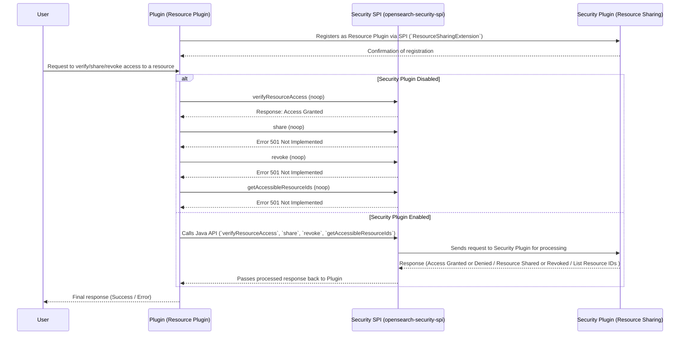

# Security SPI

This **Service Provider Interface (SPI)** provides the necessary **interfaces and mechanisms** to make security plugin extensible in OpenSearch.

### **Resource Sharing and Access Control Extension**

This extension point provides extending plugins with interfaces necessary to implement **Resource Sharing and Access Control** in OpenSearch.

---

### **Usage**

A plugin that **defines a resource** and aims to implement **access control** over that resource must **extend** the `ResourceSharingExtension` class to register itself as a **Resource Plugin**.

---

### **Checklist for plugins aiming to implement Resource Access Control**

To properly integrate with the **Resource Sharing and Access Control Extension**, follow these steps:

#### **1. Add Required Dependencies**
Include **`opensearch-security-spi`** in your **`build.gradle`** file.
Example:
```gradle
dependencies {
    compileOnly group: 'org.opensearch', name:'opensearch-security-spi', version:"${opensearch_build_version}"
}
```
---

#### **2. Declare a Resource Class**
Each plugin must define a **resource class** .
Example:
```java
public class SampleResource {
    private String id;
    private String owner;

    // Constructor, getters, setters, etc.
}
```

---

#### **3. Declare Resource Index as System index**
**Important:** Mark the resource **index as a system index** to enforce security protections.

Example:
```java
public class SampleResourcePlugin extends Plugin implements SystemIndexPlugin {

    // Override required methods

    @Override
    public Collection<SystemIndexDescriptor> getSystemIndexDescriptors(Settings settings) {
        final SystemIndexDescriptor systemIndexDescriptor = new SystemIndexDescriptor(RESOURCE_INDEX_NAME, "Sample index with resources");
        return Collections.singletonList(systemIndexDescriptor);
    }
}
```

---

#### **4. Implement the `ResourceSharingExtension` Interface**
Ensure that your **plugin declaration class** implements `ResourceSharingExtension` and provides **all required methods**.

```java
// Create a new extension point to register itself of a resource access control plugin
public class SampleResourceSharingExtension implements ResourceSharingExtension {

    @Override
    public Set<ResourceProvider> getResourceProviders() {
      return Set.of(
              new ResourceProvider(
                      SampleResource.class.getCanonicalName(), // class-name of the resource
                      RESOURCE_INDEX_NAME                     // the index that stores resource, **must only store the type of resource defined in the line above**
              )
      );
    }

    @Override
    public void assignResourceSharingClient(ResourceSharingClient resourceSharingClient) {
      ResourceSharingClientAccessor.getInstance().setResourceSharingClient(resourceSharingClient);
    }
}
```

---

#### **5. Register the Plugin Using the Java SPI Mechanism**
- Navigate to your plugin's `src/main/resources` folder.
- Locate or create the `META-INF/services` directory.
- Inside `META-INF/services`, create a file named:
  ```
  org.opensearch.security.spi.resources.ResourceSharingExtension
  ```
- Edit the file and add a **single line** containing the **fully qualified class name** of your resource sharing extension implementation class.
  Example:
  ```
  org.opensearch.sample.SampleResourceSharingExtension
  ```
  > This step ensures that OpenSearch **dynamically loads your plugin** as a resource-sharing extension.

---

#### **6. Creating a Client Accessor **
To ensure a single instance of the `ResourceSharingClient`. CLIENT will be set by security plugin if enabled via `assignResourceSharingClient`. Default to `NoopResourceSharingClient` when CLIENT is null:

```java
/**
 * Accessor for resource sharing client supplied by the SPI.
 */
public class ResourceSharingClientAccessor {
    private ResourceSharingClient CLIENT;

    private static ResourceSharingClientAccessor resourceSharingClientAccessor;

    private ResourceSharingClientAccessor() {}

    public static ResourceSharingClientAccessor getInstance() {
      if (resourceSharingClientAccessor == null) {
        resourceSharingClientAccessor = new ResourceSharingClientAccessor();
      }

      return resourceSharingClientAccessor;
    }

    /**
     * Set the resource sharing client
     */
    public void setResourceSharingClient(ResourceSharingClient client) {
      resourceSharingClientAccessor.CLIENT = client;
    }

    /**
     * Get the resource sharing client
     */
    public ResourceSharingClient getResourceSharingClient() {
      return resourceSharingClientAccessor.CLIENT;
    }
}
```

---

#### **7. Using the Client in a Transport Action**
The following example demonstrates how to use the **Resource Sharing Client** inside a `TransportAction` to verify **delete permissions** before deleting a resource.

```java
@Inject
public DeleteResourceTransportAction(TransportService transportService, ActionFilters actionFilters, NodeClient nodeClient) {
  super(DeleteResourceAction.NAME, transportService, actionFilters, DeleteResourceRequest::new);
  this.transportService = transportService;
  this.nodeClient = nodeClient;
}

@Override
protected void doExecute(Task task, DeleteResourceRequest request, ActionListener<DeleteResourceResponse> listener) {
  String resourceId = request.getResourceId();
  if (resourceId == null || resourceId.isEmpty()) {
    listener.onFailure(new IllegalArgumentException("Resource ID cannot be null or empty"));
    return;
  }
  ActionListener<DeleteResponse> deleteResponseListener = ActionListener.wrap(deleteResponse -> {
    if (deleteResponse.getResult() == DocWriteResponse.Result.NOT_FOUND) {
      listener.onFailure(new ResourceNotFoundException("Resource " + resourceId + " not found."));
    } else {
      listener.onResponse(new DeleteResourceResponse("Resource " + resourceId + " deleted successfully."));
    }
  }, exception -> {
    log.error("Failed to delete resource: " + resourceId, exception);
    listener.onFailure(exception);
  });

  // Check permission to resource
  ResourceSharingClient resourceSharingClient = ResourceSharingClientAccessor.getInstance().getResourceSharingClient();
  if (resourceSharingClient == null) {
    deleteResource(resourceId, deleteResponseListener);
    return;
  }
  resourceSharingClient.verifyResourceAccess(resourceId, RESOURCE_INDEX_NAME, ActionListener.wrap(isAuthorized -> {
    if (!isAuthorized) {
      listener.onFailure(
              new OpenSearchStatusException("Current user is not authorized to delete resource: " + resourceId, RestStatus.FORBIDDEN)
      );
      return;
    }

    // Authorization successful, proceed with deletion
    ThreadContext threadContext = transportService.getThreadPool().getThreadContext();
    try (ThreadContext.StoredContext ignored = threadContext.stashContext()) {
      deleteResource(resourceId, deleteResponseListener);
    }
  }, exception -> {
    log.error("Failed to verify resource access: " + resourceId, exception);
    listener.onFailure(exception);
  }));
}

private void deleteResource(String resourceId, ActionListener<DeleteResponse> listener) {
  DeleteRequest deleteRequest = new DeleteRequest(RESOURCE_INDEX_NAME, resourceId).setRefreshPolicy(
          WriteRequest.RefreshPolicy.IMMEDIATE
  );

  nodeClient.delete(deleteRequest, listener);
}
```

---

### **Available Java APIs**

The **`ResourceSharingClient`** provides **four Java APIs** for **resource access control**, enabling plugins to **verify, share, revoke, and list** shareableResources.

**Package Location:**
[`org.opensearch.security.spi.resources.client.ResourceSharingClient`](../spi/src/main/java/org/opensearch/security/spi/resources/client/ResourceSharingClient.java)

---

#### **API Usage Examples**
Below are examples demonstrating how to use each API effectively.

---

#### **1. `verifyResourceAccess`**
**Checks if the current user has access to a resource**.

##### **Method Signature:**
```java
void verifyResourceAccess(String resourceId, String resourceIndex, ActionListener<Boolean> listener);
```

##### **Example Usage:**
```java
resourceSharingClient.verifyResourceAccess(
    request.getResourceId(),
    RESOURCE_INDEX_NAME,
    ActionListener.wrap(isAuthorized -> {
        if (isAuthorized) {
            System.out.println("User has access to the resource.");
        } else {
            System.out.println("Access denied.");
        }
    }, e -> {
        System.err.println("Failed to verify access: " + e.getMessage());
    })
);
```
> **Use Case:** Before performing operations like **deletion or modifications**, ensure the user has the right permissions.

---

#### **2. `share`**
**Grants access to a resource** for specific users, roles, or backend roles.

##### **Method Signature:**
```java
void shareResource(String resourceId, String resourceIndex, SharedWithActionGroup.ActionGroupRecipients recipients, ActionListener<ResourceSharing> listener);
```

##### **Example Usage:**
```java

resourceSharingClient.share(
    request.getResourceId(),
    RESOURCE_INDEX_NAME,
    request.getShareWith(),
    ActionListener.wrap(sharing -> {
        ShareResourceResponse response = new ShareResourceResponse(sharing.getShareWith());
        listener.onResponse(response);
    }, listener::onFailure)
);
```
> **Use Case:** Used when an **owner/admin wants to share a resource** with specific users or groups.

---

#### **3. `revoke`**
**Removes access permissions** for specified users, roles, or backend roles.

##### **Method Signature:**
```java
void revoke(String resourceId, String resourceIndex, SharedWithActionGroup.ActionGroupRecipients entitiesToRevoke, ActionListener<ResourceSharing> listener);
```

##### **Example Usage:**
```java
resourceSharingClient.revokeResourceAccess(
    request.getResourceId(),
    RESOURCE_INDEX_NAME,
    request.getEntitiesToRevoke(),
    ActionListener.wrap(success -> {
        RevokeResourceAccessResponse response = new RevokeResourceAccessResponse(success.getShareWith());
            listener.onResponse(response);
        }, listener::onFailure)
);
```
> **Use Case:** When a user no longer needs access to a **resource**, their permissions can be revoked.

---

#### **4. `getAccessibleResourceIds`**
**Retrieves ids of all shareableResources the current user has access to.**

##### **Method Signature:**
```java
void getAccessibleResourceIds(String resourceIndex, ActionListener<Set<String>> listener);
```

##### **Example Usage:**
```java
resourceSharingClient.getAccessibleResourceIds(RESOURCE_INDEX_NAME, ActionListener.wrap(resourceIds -> {
  log.debug("Fetched accessible resources ids: {}", resourceIds);
  getResourcesFromIds(resourceIds, listener);
}, listener::onFailure));
```
> **Use Case:** Helps a user identify **which shareableResources they can interact with**.

##### **Sample Request Flow:**



---

## **License**
This project is licensed under the **Apache 2.0 License**.

---

## **Copyright**
© OpenSearch Contributors.

---
