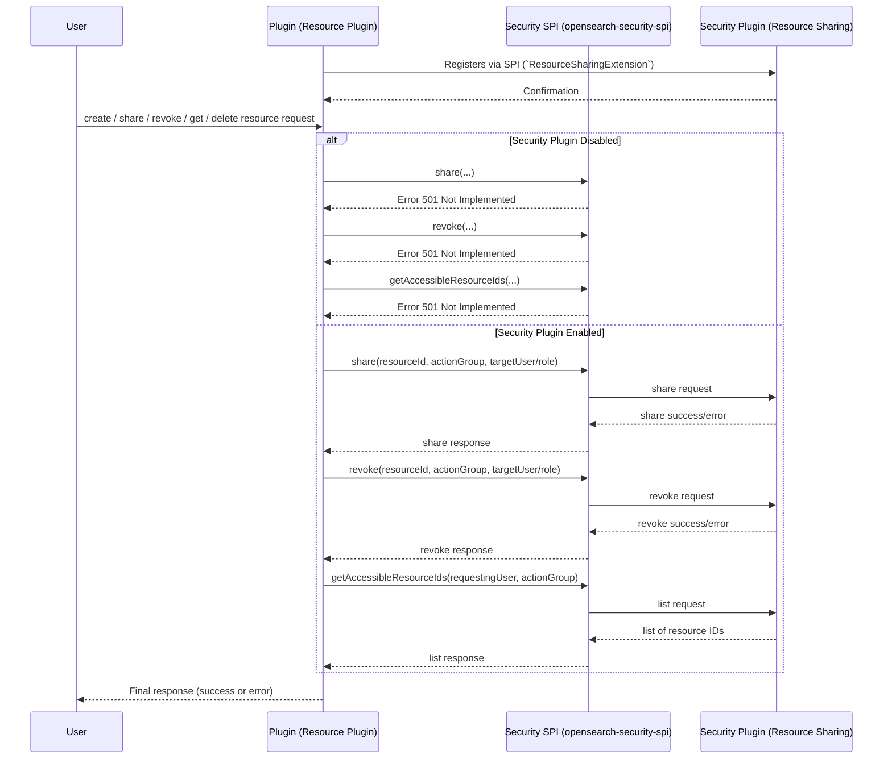

# Security SPI

This **Service Provider Interface (SPI)** provides the necessary **interfaces and mechanisms** to make security plugin extensible in OpenSearch.

### **Resource Sharing and Access Control Extension**

This extension point provides extending plugins with interfaces necessary to implement **Resource Sharing and Access Control** in OpenSearch.

---

### **Usage**

A plugin that **defines a resource** and aims to implement **access control** over that resource must **extend** the `ResourceSharingExtension` class to register itself as a **Resource Plugin**.

---

### **Checklist for plugins aiming to implement Resource Access Control**

To properly integrate with the **Resource Sharing and Access Control Extension**, follow these steps:

#### **1. Add Required Dependencies**
Include **`opensearch-security-spi`** in your **`build.gradle`** file.
Example:
```gradle
dependencies {
    compileOnly group: 'org.opensearch', name:'opensearch-security-spi', version:"${opensearch_build_version}"
}
```
---

#### **2. Declare a Resource Class**
Each plugin must define a **resource class** .
Example:
```java
public class SampleResource {
    private String id;
    private String owner;

    // Constructor, getters, setters, etc.
}
```

---

#### **3. Declare Resource Index as System index**
**Important:** Mark the resource **index as a system index** to enforce security protections.

Example:
```java
public class SampleResourcePlugin extends Plugin implements SystemIndexPlugin {

    // Override required methods

    @Override
    public Collection<SystemIndexDescriptor> getSystemIndexDescriptors(Settings settings) {
        final SystemIndexDescriptor systemIndexDescriptor = new SystemIndexDescriptor(RESOURCE_INDEX_NAME, "Sample index with resources");
        return Collections.singletonList(systemIndexDescriptor);
    }
}
```

---

#### **4. Implement the `ResourceSharingExtension` Interface**
Ensure that your **plugin declaration class** implements `ResourceSharingExtension` and provides **all required methods**.

```java
// Create a new extension point to register itself of a resource access control plugin
public class SampleResourceExtension implements ResourceSharingExtension {
  private ResourceSharingClient client;

  @Override
  public Set<ResourceProvider> getResourceProviders() {
    return Set.of(new ResourceProvider(SampleResource.class.getCanonicalName(), RESOURCE_INDEX_NAME));
  }

  @Override
  public void assignResourceSharingClient(ResourceSharingClient resourceSharingClient) {
    this.client = resourceSharingClient;
  }

  @Override
  public ResourceSharingClient getResourceSharingClient() {
    return this.client;
  }
}
```

---

#### **5. Register the Plugin Using the Java SPI Mechanism**
- Navigate to your plugin's `src/main/resources` folder.
- Locate or create the `META-INF/services` directory.
- Inside `META-INF/services`, create a file named:
  ```
  org.opensearch.security.spi.resources.ResourceSharingExtension
  ```
- Edit the file and add a **single line** containing the **fully qualified class name** of your resource sharing extension implementation class.
  Example:
  ```
  org.opensearch.sample.SampleResourceExtension
  ```
  > This step ensures that OpenSearch **dynamically loads your plugin** as a resource-sharing extension.

---

#### **6. Using the Client in a Transport Action**
The following example demonstrates how to use the **Resource Sharing Client** inside a `TransportAction` to verify **delete permissions** before deleting a resource.

```java
public class ShareResourceTransportAction extends HandledTransportAction<ShareResourceRequest, ShareResourceResponse> {
  private static final Logger log = LogManager.getLogger(ShareResourceTransportAction.class);
  @Inject(optional=true)
  private final SampleResourceExtension sampleResourceExtension;

  @Inject
  public ShareResourceTransportAction(TransportService transportService, ActionFilters actionFilters) {
    super(ShareResourceAction.NAME, transportService, actionFilters, ShareResourceRequest::new);
  }

  @Override
  protected void doExecute(Task task, ShareResourceRequest request, ActionListener<ShareResourceResponse> listener) {
    if (request.getResourceId() == null || request.getResourceId().isEmpty()) {
      listener.onFailure(new IllegalArgumentException("Resource ID cannot be null or empty"));
      return;
    }

    if (sampleResourceExtension == null || sampleResourceExtension.getResourceSharingClient() == null) {
      listener.onFailure(
              new OpenSearchStatusException(
                      "Resource sharing is not enabled. Cannot share resource " + request.getResourceId(),
                      RestStatus.NOT_IMPLEMENTED
              )
      );
      return;
    }
    ShareWith shareWith = request.getShareWith();
    ResourceSharingClient resourceSharingClient = sampleResourceExtension.getResourceSharingClient();
    resourceSharingClient.share(request.getResourceId(), RESOURCE_INDEX_NAME, shareWith, ActionListener.wrap(sharing -> {
      ShareWith finalShareWith = sharing == null ? null : sharing.getShareWith();
      ShareResourceResponse response = new ShareResourceResponse(finalShareWith);
      log.debug("Shared resource: {}", response.toString());
      listener.onResponse(response);
    }, listener::onFailure));
  }

}
```

---

### **Available Java APIs**

The **`ResourceSharingClient`** provides **four Java APIs** for **resource access control**, enabling plugins to **verify, share, revoke, and list** shareableResources.

**Package Location:**
[`org.opensearch.security.spi.resources.client.ResourceSharingClient`](../spi/src/main/java/org/opensearch/security/spi/resources/client/ResourceSharingClient.java)

---

#### **API Usage Examples**
Below are examples demonstrating how to use each API effectively.

---
#### **1. `verifyAccess`**
**Check access** for specific users, roles, or backend roles **for specified action**.

NOTE: This API should only be selectively used in case where implementing DocRequest interface for action-requests is not possible. Check out sample-plugin action-request classes to understand more.

##### **Method Signature:**
```java
void verifyAccess(String resourceId, String resourceIndex, String action, ActionListener<Boolean> listener);
```

##### **Example Usage:**
```java

resourceSharingClient.verifyAccess(
    request.getResourceId(),
    RESOURCE_INDEX_NAME,
    "indices:data/read/search",
    ActionListener.wrap(isAuthorized -> {
        if (isAuthorized) {
        System.out.println("User has access to the resource.");
        } else {
                System.out.println("Access denied.");
        }
    }, e -> {
    System.err.println("Failed to verify access: " + e.getMessage());
    })
);
```
> **Use Case:** Used when an **owner/admin wants to share a resource** with specific users or groups.

---

#### **2. `share`**
**Grants access to a resource** for specific users, roles, or backend roles.

##### **Method Signature:**
```java
void shareResource(String resourceId, String resourceIndex, SharedWithActionGroup.ActionGroupRecipients recipients, ActionListener<ResourceSharing> listener);
```

##### **Example Usage:**
```java

resourceSharingClient.share(
    request.getResourceId(),
    RESOURCE_INDEX_NAME,
    request.getShareWith(),
    ActionListener.wrap(sharing -> {
        ShareResourceResponse response = new ShareResourceResponse(sharing.getShareWith());
        listener.onResponse(response);
    }, listener::onFailure)
);
```
> **Use Case:** Used when an **owner/admin wants to share a resource** with specific users or groups.

---

#### **3. `revoke`**
**Removes access permissions** for specified users, roles, or backend roles.

##### **Method Signature:**
```java
void revoke(String resourceId, String resourceIndex, SharedWithActionGroup.ActionGroupRecipients entitiesToRevoke, ActionListener<ResourceSharing> listener);
```

##### **Example Usage:**
```java
resourceSharingClient.revokeResourceAccess(
    request.getResourceId(),
    RESOURCE_INDEX_NAME,
    request.getEntitiesToRevoke(),
    ActionListener.wrap(success -> {
        RevokeResourceAccessResponse response = new RevokeResourceAccessResponse(success.getShareWith());
            listener.onResponse(response);
        }, listener::onFailure)
);
```
> **Use Case:** When a user no longer needs access to a **resource**, their permissions can be revoked.

---

#### **4. `getAccessibleResourceIds`**
**Retrieves ids of all shareableResources the current user has access to.**

##### **Method Signature:**
```java
void getAccessibleResourceIds(String resourceIndex, ActionListener<Set<String>> listener);
```

##### **Example Usage:**
```java
resourceSharingClient.getAccessibleResourceIds(RESOURCE_INDEX_NAME, ActionListener.wrap(resourceIds -> {
  log.debug("Fetched accessible resources ids: {}", resourceIds);
  getResourcesFromIds(resourceIds, listener);
}, listener::onFailure));
```
> **Use Case:** Helps a user identify **which shareableResources they can interact with**.

##### **Sample Request Flow:**



---

## **License**
This project is licensed under the **Apache 2.0 License**.

---

## **Copyright**
© OpenSearch Contributors.

---
